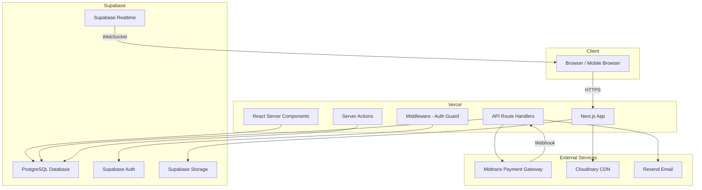
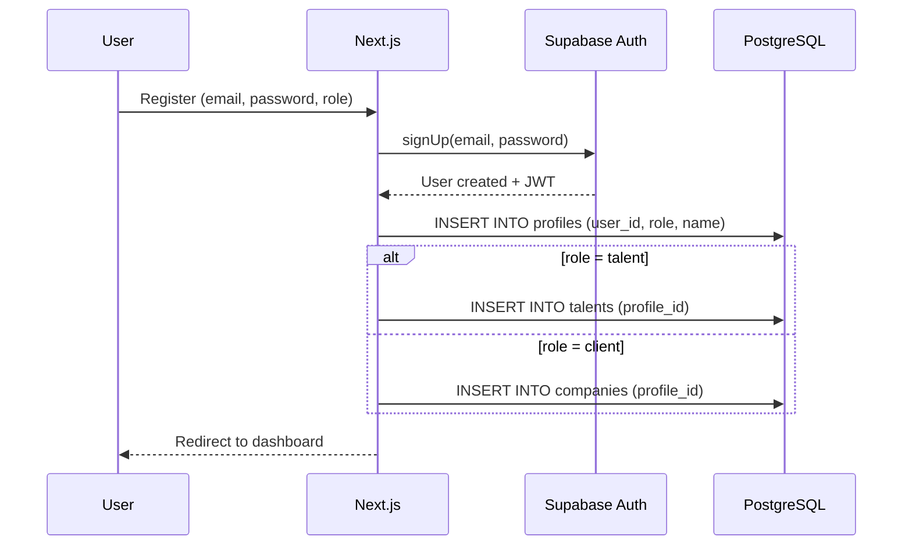
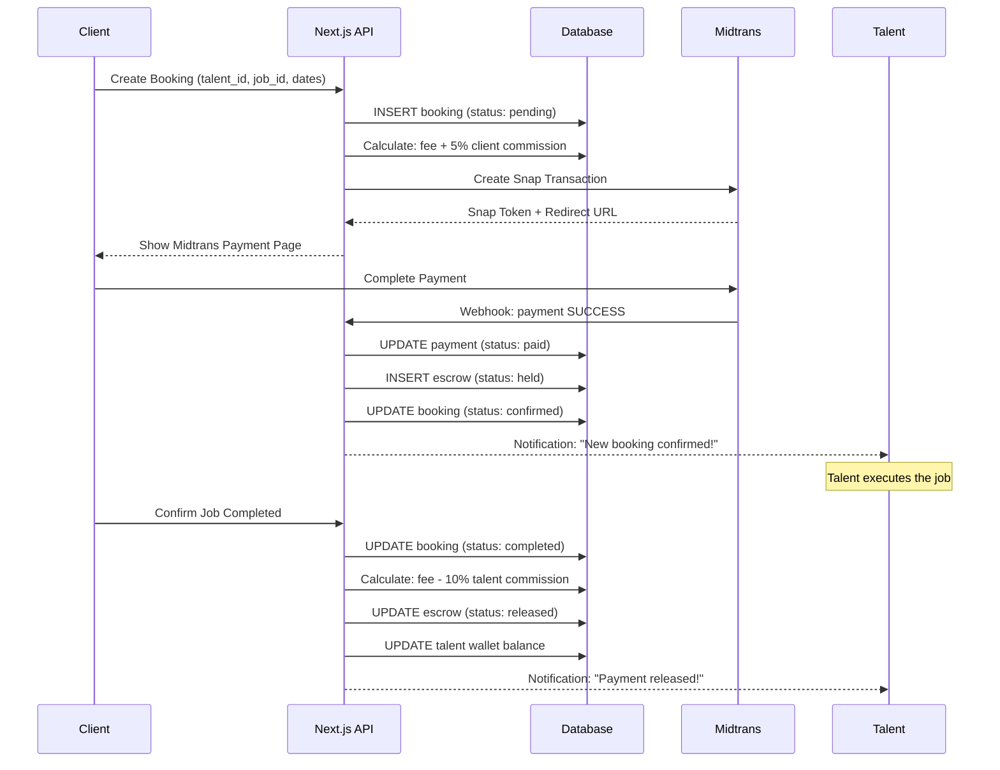
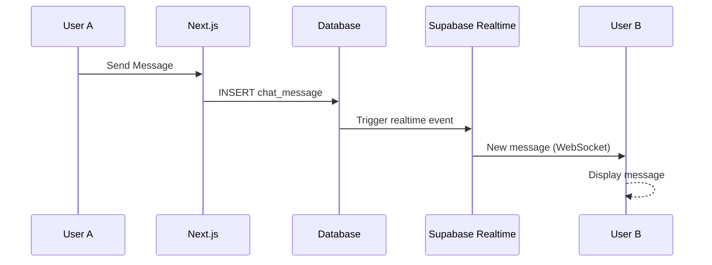
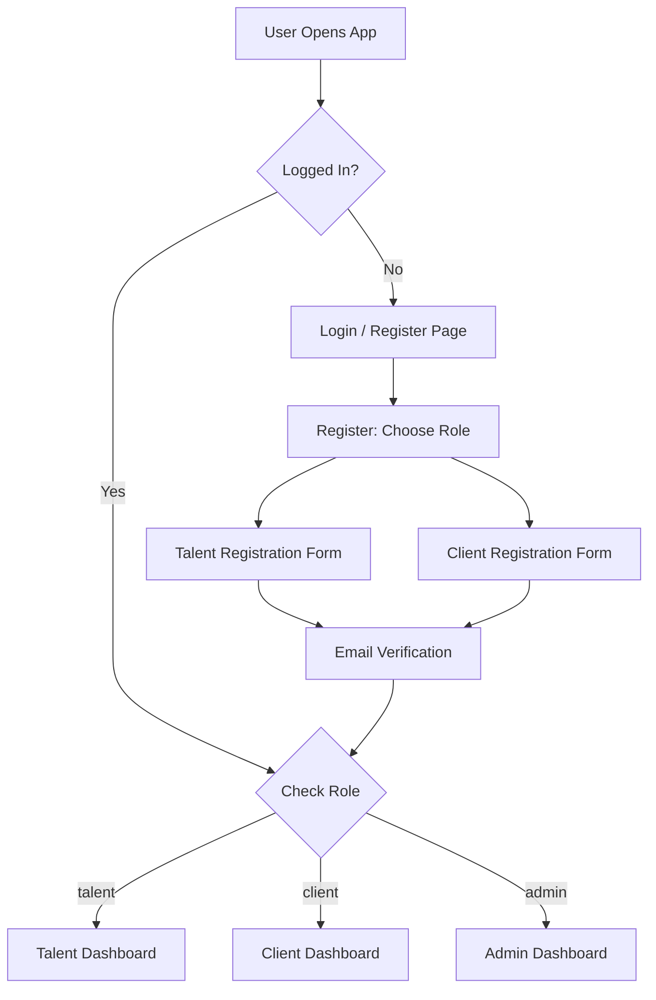

# PANDUAN IMPLEMENTASI TALENTARA

**Technical Implementation Guide**
**Platform Marketplace Talent Digital**

> Dokumen ini adalah panduan teknis lengkap untuk membangun platform TALENTARA.
> Developer dapat langsung menggunakan dokumen ini sebagai referensi utama selama proses development.

---

## Daftar Isi

1. [Tech Stack Selection](#1-tech-stack-selection)
2. [System Architecture](#2-system-architecture)
3. [Database Schema](#3-database-schema)
4. [API Endpoints](#4-api-endpoints)
5. [Project Structure](#5-project-structure)
6. [Feature Implementation Details](#6-feature-implementation-details)
7. [Authentication & Authorization](#7-authentication--authorization)
8. [Payment Flow (Escrow)](#8-payment-flow-escrow)
9. [Third-Party Integrations](#9-third-party-integrations)
10. [Development Phases](#10-development-phases)
11. [Deployment Strategy](#11-deployment-strategy)
12. [Testing Strategy](#12-testing-strategy)
13. [Environment & Configuration](#13-environment--configuration)
14. [Lampiran](#14-lampiran)

---

## 1. Tech Stack Selection

### 1.1 Teknologi Utama

| Layer | Teknologi | Versi | Alasan |
|---|---|---|---|
| **Framework** | Next.js (App Router) | 15.x | Full-stack, SSR/SSG, API routes built-in, React Server Components |
| **Language** | TypeScript | 5.x | Type safety, developer experience, mengurangi bug |
| **Styling** | Tailwind CSS | 3.x | Utility-first, responsive cepat, mobile-first |
| **UI Components** | shadcn/ui | latest | Komponen accessible, customizable, copy-paste |
| **Database** | Supabase (PostgreSQL) | - | Free tier 500MB, auth built-in, realtime, storage, RLS |
| **Authentication** | Supabase Auth | - | Gratis, email + Google OAuth, role-based |
| **File Storage** | Supabase Storage + Cloudinary | - | Upload foto/video, image optimization & CDN |
| **Payment Gateway** | Midtrans (Snap) | - | Lokal Indonesia, sandbox gratis, VA + e-wallet + QRIS |
| **Hosting** | Vercel | - | Auto-deploy dari GitHub, edge functions, CDN global |
| **Email Service** | Resend | - | Free tier 100 email/hari, transactional email |
| **State Management** | Zustand | 4.x | Lightweight, simple, no boilerplate |
| **Form & Validation** | React Hook Form + Zod | - | Type-safe validation, performant forms |
| **Realtime** | Supabase Realtime | - | WebSocket built-in, gratis dengan Supabase |
| **Icons** | Lucide React | - | Lightweight, tree-shakeable, 1000+ icons |
| **Date Handling** | date-fns | - | Lightweight, modular, locale Indonesia |

### 1.2 Estimasi Biaya Infrastruktur Bulanan

| Service | Plan | Biaya/Bulan |
|---|---|---|
| Supabase | Free (500MB DB, 1GB storage) | Rp 0 |
| Vercel | Hobby (free) atau Pro ($20) | Rp 0 - Rp 320.000 |
| Cloudinary | Free (25GB bandwidth) | Rp 0 |
| Resend | Free (100 email/hari) | Rp 0 |
| Midtrans | Per transaksi (2.9% + Rp 2.000) | Variabel |
| Domain (.com) | Tahunan | ~Rp 150.000/tahun |
| **Total** | | **~Rp 0 - Rp 350.000/bulan** |

> **Catatan:** Pada fase awal (0-500 user), seluruh free tier sudah mencukupi. Upgrade ke paid plan saat traffic meningkat.

### 1.3 Mengapa Stack Ini?

- **Next.js + Supabase** = Full-stack tanpa perlu server terpisah, ideal untuk tim kecil
- **Supabase** menggantikan kebutuhan: Database, Auth, Realtime, File Storage dalam 1 service
- **Midtrans** = Payment gateway lokal Indonesia, support semua metode pembayaran populer
- **Vercel** = Zero-config deployment, auto SSL, preview deployments untuk setiap PR
- **Total cost near-zero** pada tahap MVP, bayar sesuai pertumbuhan (pay-as-you-grow)

---

## 2. System Architecture

### 2.1 High-Level Architecture



### 2.2 Data Flow: Authentication



### 2.3 Data Flow: Booking & Payment (Escrow)



### 2.4 Data Flow: Chat (Realtime)



---

## 3. Database Schema

### 3.1 Entity Relationship Overview

```
profiles (1) ──── (1) talents
profiles (1) ──── (1) companies
talents  (1) ──── (N) talent_portfolios
talents  (1) ──── (N) talent_experiences
companies(1) ──── (N) jobs
jobs     (1) ──── (N) job_applications
jobs     (1) ──── (N) bookings
bookings (1) ──── (1) payments
payments (1) ──── (1) escrow_transactions
bookings (1) ──── (1) reviews
profiles (1) ──── (N) chat_rooms (as participant)
chat_rooms(1)──── (N) chat_messages
profiles (1) ──── (N) notifications
talents  (1) ──── (N) withdrawals
bookings (1) ──── (0..1) disputes
```

### 3.2 SQL Schema Lengkap

```sql
-- ============================================
-- 1. PROFILES (extends Supabase auth.users)
-- ============================================
CREATE TABLE profiles (
    id UUID PRIMARY KEY REFERENCES auth.users(id) ON DELETE CASCADE,
    role VARCHAR(20) NOT NULL CHECK (role IN ('talent', 'client', 'admin')),
    full_name VARCHAR(100) NOT NULL,
    email VARCHAR(255) NOT NULL UNIQUE,
    phone VARCHAR(20),
    avatar_url TEXT,
    is_verified BOOLEAN DEFAULT FALSE,
    is_active BOOLEAN DEFAULT TRUE,
    created_at TIMESTAMPTZ DEFAULT NOW(),
    updated_at TIMESTAMPTZ DEFAULT NOW()
);

-- ============================================
-- 2. TALENTS
-- ============================================
CREATE TABLE talents (
    id UUID PRIMARY KEY DEFAULT gen_random_uuid(),
    profile_id UUID NOT NULL UNIQUE REFERENCES profiles(id) ON DELETE CASCADE,
    category VARCHAR(20) NOT NULL CHECK (category IN ('spg', 'usher', 'both')),
    gender VARCHAR(10) CHECK (gender IN ('male', 'female')),
    date_of_birth DATE,
    height_cm INTEGER,
    weight_kg INTEGER,
    city VARCHAR(100),
    province VARCHAR(100),
    address TEXT,
    bio TEXT,
    ktp_number VARCHAR(20),
    ktp_photo_url TEXT,
    selfie_photo_url TEXT,
    verification_status VARCHAR(20) DEFAULT 'pending'
        CHECK (verification_status IN ('pending', 'verified', 'rejected')),
    rating_avg DECIMAL(3,2) DEFAULT 0.00,
    rating_count INTEGER DEFAULT 0,
    total_jobs_completed INTEGER DEFAULT 0,
    wallet_balance BIGINT DEFAULT 0, -- dalam Rupiah
    daily_rate BIGINT, -- fee per hari dalam Rupiah
    is_available BOOLEAN DEFAULT TRUE,
    created_at TIMESTAMPTZ DEFAULT NOW(),
    updated_at TIMESTAMPTZ DEFAULT NOW()
);

CREATE INDEX idx_talents_category ON talents(category);
CREATE INDEX idx_talents_city ON talents(city);
CREATE INDEX idx_talents_rating ON talents(rating_avg DESC);
CREATE INDEX idx_talents_available ON talents(is_available) WHERE is_available = TRUE;

-- ============================================
-- 3. TALENT PORTFOLIOS
-- ============================================
CREATE TABLE talent_portfolios (
    id UUID PRIMARY KEY DEFAULT gen_random_uuid(),
    talent_id UUID NOT NULL REFERENCES talents(id) ON DELETE CASCADE,
    media_type VARCHAR(10) NOT NULL CHECK (media_type IN ('image', 'video')),
    media_url TEXT NOT NULL,
    thumbnail_url TEXT,
    caption TEXT,
    event_name VARCHAR(200),
    sort_order INTEGER DEFAULT 0,
    created_at TIMESTAMPTZ DEFAULT NOW()
);

CREATE INDEX idx_portfolios_talent ON talent_portfolios(talent_id);

-- ============================================
-- 4. TALENT EXPERIENCES
-- ============================================
CREATE TABLE talent_experiences (
    id UUID PRIMARY KEY DEFAULT gen_random_uuid(),
    talent_id UUID NOT NULL REFERENCES talents(id) ON DELETE CASCADE,
    company_name VARCHAR(200) NOT NULL,
    event_name VARCHAR(200),
    role VARCHAR(50) NOT NULL, -- 'SPG', 'Usher', etc.
    description TEXT,
    start_date DATE,
    end_date DATE,
    created_at TIMESTAMPTZ DEFAULT NOW()
);

CREATE INDEX idx_experiences_talent ON talent_experiences(talent_id);

-- ============================================
-- 5. COMPANIES
-- ============================================
CREATE TABLE companies (
    id UUID PRIMARY KEY DEFAULT gen_random_uuid(),
    profile_id UUID NOT NULL UNIQUE REFERENCES profiles(id) ON DELETE CASCADE,
    company_name VARCHAR(200) NOT NULL,
    company_type VARCHAR(50), -- 'corporate', 'brand', 'event_organizer'
    industry VARCHAR(100),
    npwp VARCHAR(30),
    nib VARCHAR(30),
    address TEXT,
    city VARCHAR(100),
    province VARCHAR(100),
    website VARCHAR(255),
    company_logo_url TEXT,
    legal_doc_url TEXT, -- dokumen legalitas
    verification_status VARCHAR(20) DEFAULT 'pending'
        CHECK (verification_status IN ('pending', 'verified', 'rejected')),
    created_at TIMESTAMPTZ DEFAULT NOW(),
    updated_at TIMESTAMPTZ DEFAULT NOW()
);

CREATE INDEX idx_companies_city ON companies(city);

-- ============================================
-- 6. JOBS
-- ============================================
CREATE TABLE jobs (
    id UUID PRIMARY KEY DEFAULT gen_random_uuid(),
    company_id UUID NOT NULL REFERENCES companies(id) ON DELETE CASCADE,
    title VARCHAR(200) NOT NULL,
    description TEXT NOT NULL,
    category VARCHAR(20) NOT NULL CHECK (category IN ('spg', 'usher', 'both')),
    job_type VARCHAR(30) DEFAULT 'one_time'
        CHECK (job_type IN ('one_time', 'recurring', 'long_term')),
    location_city VARCHAR(100) NOT NULL,
    location_address TEXT,
    start_date DATE NOT NULL,
    end_date DATE NOT NULL,
    start_time TIME,
    end_time TIME,
    daily_rate BIGINT NOT NULL, -- fee per hari dalam Rupiah
    total_slots INTEGER NOT NULL DEFAULT 1, -- jumlah talent dibutuhkan
    filled_slots INTEGER DEFAULT 0,
    gender_requirement VARCHAR(10) CHECK (gender_requirement IN ('male', 'female', 'any')),
    min_height_cm INTEGER,
    min_age INTEGER,
    max_age INTEGER,
    dress_code TEXT,
    requirements TEXT, -- requirement tambahan
    status VARCHAR(20) DEFAULT 'open'
        CHECK (status IN ('draft', 'open', 'in_progress', 'completed', 'cancelled')),
    created_at TIMESTAMPTZ DEFAULT NOW(),
    updated_at TIMESTAMPTZ DEFAULT NOW()
);

CREATE INDEX idx_jobs_company ON jobs(company_id);
CREATE INDEX idx_jobs_category ON jobs(category);
CREATE INDEX idx_jobs_city ON jobs(location_city);
CREATE INDEX idx_jobs_status ON jobs(status);
CREATE INDEX idx_jobs_date ON jobs(start_date);

-- ============================================
-- 7. JOB APPLICATIONS
-- ============================================
CREATE TABLE job_applications (
    id UUID PRIMARY KEY DEFAULT gen_random_uuid(),
    job_id UUID NOT NULL REFERENCES jobs(id) ON DELETE CASCADE,
    talent_id UUID NOT NULL REFERENCES talents(id) ON DELETE CASCADE,
    cover_message TEXT,
    status VARCHAR(20) DEFAULT 'pending'
        CHECK (status IN ('pending', 'accepted', 'rejected', 'withdrawn')),
    applied_at TIMESTAMPTZ DEFAULT NOW(),
    responded_at TIMESTAMPTZ,
    UNIQUE(job_id, talent_id) -- talent hanya bisa apply 1x per job
);

CREATE INDEX idx_applications_job ON job_applications(job_id);
CREATE INDEX idx_applications_talent ON job_applications(talent_id);

-- ============================================
-- 8. BOOKINGS
-- ============================================
CREATE TABLE bookings (
    id UUID PRIMARY KEY DEFAULT gen_random_uuid(),
    booking_code VARCHAR(20) NOT NULL UNIQUE, -- TLNT-20250101-XXXX
    job_id UUID NOT NULL REFERENCES jobs(id),
    talent_id UUID NOT NULL REFERENCES talents(id),
    company_id UUID NOT NULL REFERENCES companies(id),
    start_date DATE NOT NULL,
    end_date DATE NOT NULL,
    total_days INTEGER NOT NULL,
    daily_rate BIGINT NOT NULL,
    talent_fee BIGINT NOT NULL, -- total fee talent (daily_rate x days)
    talent_commission BIGINT NOT NULL, -- 10% dari talent_fee
    client_commission BIGINT NOT NULL, -- 5% dari talent_fee
    platform_revenue BIGINT NOT NULL, -- talent_commission + client_commission
    total_amount BIGINT NOT NULL, -- talent_fee + client_commission (yang dibayar klien)
    talent_payout BIGINT NOT NULL, -- talent_fee - talent_commission (yang diterima talent)
    status VARCHAR(20) DEFAULT 'pending'
        CHECK (status IN (
            'pending',        -- menunggu pembayaran
            'paid',           -- sudah dibayar, menunggu job
            'in_progress',    -- job sedang berjalan
            'completed',      -- job selesai, menunggu konfirmasi
            'confirmed',      -- klien konfirmasi selesai
            'cancelled',      -- dibatalkan
            'disputed'        -- ada masalah
        )),
    notes TEXT,
    created_at TIMESTAMPTZ DEFAULT NOW(),
    updated_at TIMESTAMPTZ DEFAULT NOW()
);

CREATE INDEX idx_bookings_talent ON bookings(talent_id);
CREATE INDEX idx_bookings_company ON bookings(company_id);
CREATE INDEX idx_bookings_job ON bookings(job_id);
CREATE INDEX idx_bookings_status ON bookings(status);

-- ============================================
-- 9. PAYMENTS
-- ============================================
CREATE TABLE payments (
    id UUID PRIMARY KEY DEFAULT gen_random_uuid(),
    booking_id UUID NOT NULL REFERENCES bookings(id),
    midtrans_order_id VARCHAR(100) UNIQUE,
    midtrans_transaction_id VARCHAR(100),
    payment_type VARCHAR(50), -- 'bank_transfer', 'gopay', 'shopeepay', 'qris', etc.
    amount BIGINT NOT NULL,
    status VARCHAR(20) DEFAULT 'pending'
        CHECK (status IN ('pending', 'paid', 'expired', 'failed', 'refunded')),
    snap_token TEXT,
    snap_redirect_url TEXT,
    paid_at TIMESTAMPTZ,
    expired_at TIMESTAMPTZ,
    midtrans_response JSONB, -- raw response dari Midtrans
    created_at TIMESTAMPTZ DEFAULT NOW(),
    updated_at TIMESTAMPTZ DEFAULT NOW()
);

CREATE INDEX idx_payments_booking ON payments(booking_id);
CREATE INDEX idx_payments_midtrans ON payments(midtrans_order_id);

-- ============================================
-- 10. ESCROW TRANSACTIONS
-- ============================================
CREATE TABLE escrow_transactions (
    id UUID PRIMARY KEY DEFAULT gen_random_uuid(),
    payment_id UUID NOT NULL REFERENCES payments(id),
    booking_id UUID NOT NULL REFERENCES bookings(id),
    talent_id UUID NOT NULL REFERENCES talents(id),
    amount BIGINT NOT NULL, -- jumlah yang di-hold
    talent_payout BIGINT NOT NULL, -- jumlah yang akan diterima talent
    platform_fee BIGINT NOT NULL, -- total komisi platform
    status VARCHAR(20) DEFAULT 'held'
        CHECK (status IN ('held', 'released', 'refunded', 'disputed')),
    held_at TIMESTAMPTZ DEFAULT NOW(),
    released_at TIMESTAMPTZ,
    created_at TIMESTAMPTZ DEFAULT NOW()
);

CREATE INDEX idx_escrow_booking ON escrow_transactions(booking_id);
CREATE INDEX idx_escrow_talent ON escrow_transactions(talent_id);

-- ============================================
-- 11. REVIEWS
-- ============================================
CREATE TABLE reviews (
    id UUID PRIMARY KEY DEFAULT gen_random_uuid(),
    booking_id UUID NOT NULL UNIQUE REFERENCES bookings(id),
    reviewer_id UUID NOT NULL REFERENCES profiles(id), -- client yang review
    talent_id UUID NOT NULL REFERENCES talents(id),
    rating INTEGER NOT NULL CHECK (rating >= 1 AND rating <= 5),
    comment TEXT,
    professionalism INTEGER CHECK (professionalism >= 1 AND professionalism <= 5),
    punctuality INTEGER CHECK (punctuality >= 1 AND punctuality <= 5),
    appearance INTEGER CHECK (appearance >= 1 AND appearance <= 5),
    communication INTEGER CHECK (communication >= 1 AND communication <= 5),
    created_at TIMESTAMPTZ DEFAULT NOW()
);

CREATE INDEX idx_reviews_talent ON reviews(talent_id);

-- ============================================
-- 12. CHAT ROOMS
-- ============================================
CREATE TABLE chat_rooms (
    id UUID PRIMARY KEY DEFAULT gen_random_uuid(),
    booking_id UUID REFERENCES bookings(id), -- optional, bisa chat tanpa booking
    participant_1 UUID NOT NULL REFERENCES profiles(id),
    participant_2 UUID NOT NULL REFERENCES profiles(id),
    last_message TEXT,
    last_message_at TIMESTAMPTZ,
    created_at TIMESTAMPTZ DEFAULT NOW()
);

CREATE INDEX idx_chatrooms_p1 ON chat_rooms(participant_1);
CREATE INDEX idx_chatrooms_p2 ON chat_rooms(participant_2);

-- ============================================
-- 13. CHAT MESSAGES
-- ============================================
CREATE TABLE chat_messages (
    id UUID PRIMARY KEY DEFAULT gen_random_uuid(),
    room_id UUID NOT NULL REFERENCES chat_rooms(id) ON DELETE CASCADE,
    sender_id UUID NOT NULL REFERENCES profiles(id),
    message TEXT NOT NULL,
    message_type VARCHAR(20) DEFAULT 'text'
        CHECK (message_type IN ('text', 'image', 'system')),
    is_read BOOLEAN DEFAULT FALSE,
    created_at TIMESTAMPTZ DEFAULT NOW()
);

CREATE INDEX idx_messages_room ON chat_messages(room_id, created_at DESC);

-- ============================================
-- 14. NOTIFICATIONS
-- ============================================
CREATE TABLE notifications (
    id UUID PRIMARY KEY DEFAULT gen_random_uuid(),
    user_id UUID NOT NULL REFERENCES profiles(id) ON DELETE CASCADE,
    type VARCHAR(50) NOT NULL, -- 'new_job', 'booking_confirmed', 'payment_received', etc.
    title VARCHAR(200) NOT NULL,
    message TEXT NOT NULL,
    data JSONB, -- additional data (booking_id, job_id, etc.)
    is_read BOOLEAN DEFAULT FALSE,
    created_at TIMESTAMPTZ DEFAULT NOW()
);

CREATE INDEX idx_notifications_user ON notifications(user_id, created_at DESC);
CREATE INDEX idx_notifications_unread ON notifications(user_id, is_read) WHERE is_read = FALSE;

-- ============================================
-- 15. WITHDRAWALS
-- ============================================
CREATE TABLE withdrawals (
    id UUID PRIMARY KEY DEFAULT gen_random_uuid(),
    talent_id UUID NOT NULL REFERENCES talents(id),
    amount BIGINT NOT NULL,
    bank_name VARCHAR(50) NOT NULL,
    bank_account_number VARCHAR(30) NOT NULL,
    bank_account_name VARCHAR(100) NOT NULL,
    status VARCHAR(20) DEFAULT 'pending'
        CHECK (status IN ('pending', 'processing', 'completed', 'rejected')),
    admin_notes TEXT,
    processed_at TIMESTAMPTZ,
    created_at TIMESTAMPTZ DEFAULT NOW()
);

CREATE INDEX idx_withdrawals_talent ON withdrawals(talent_id);

-- ============================================
-- 16. DISPUTES
-- ============================================
CREATE TABLE disputes (
    id UUID PRIMARY KEY DEFAULT gen_random_uuid(),
    booking_id UUID NOT NULL UNIQUE REFERENCES bookings(id),
    raised_by UUID NOT NULL REFERENCES profiles(id),
    reason TEXT NOT NULL,
    evidence_urls TEXT[], -- array of URLs
    status VARCHAR(20) DEFAULT 'open'
        CHECK (status IN ('open', 'investigating', 'resolved_talent', 'resolved_client', 'closed')),
    resolution TEXT,
    resolved_by UUID REFERENCES profiles(id),
    created_at TIMESTAMPTZ DEFAULT NOW(),
    resolved_at TIMESTAMPTZ
);

-- ============================================
-- TRIGGERS: Auto-update updated_at
-- ============================================
CREATE OR REPLACE FUNCTION update_updated_at()
RETURNS TRIGGER AS $$
BEGIN
    NEW.updated_at = NOW();
    RETURN NEW;
END;
$$ LANGUAGE plpgsql;

CREATE TRIGGER tr_profiles_updated_at BEFORE UPDATE ON profiles
    FOR EACH ROW EXECUTE FUNCTION update_updated_at();
CREATE TRIGGER tr_talents_updated_at BEFORE UPDATE ON talents
    FOR EACH ROW EXECUTE FUNCTION update_updated_at();
CREATE TRIGGER tr_companies_updated_at BEFORE UPDATE ON companies
    FOR EACH ROW EXECUTE FUNCTION update_updated_at();
CREATE TRIGGER tr_jobs_updated_at BEFORE UPDATE ON jobs
    FOR EACH ROW EXECUTE FUNCTION update_updated_at();
CREATE TRIGGER tr_bookings_updated_at BEFORE UPDATE ON bookings
    FOR EACH ROW EXECUTE FUNCTION update_updated_at();
CREATE TRIGGER tr_payments_updated_at BEFORE UPDATE ON payments
    FOR EACH ROW EXECUTE FUNCTION update_updated_at();

-- ============================================
-- TRIGGER: Update talent rating setelah review baru
-- ============================================
CREATE OR REPLACE FUNCTION update_talent_rating()
RETURNS TRIGGER AS $$
BEGIN
    UPDATE talents SET
        rating_avg = (
            SELECT COALESCE(AVG(rating), 0)
            FROM reviews WHERE talent_id = NEW.talent_id
        ),
        rating_count = (
            SELECT COUNT(*)
            FROM reviews WHERE talent_id = NEW.talent_id
        )
    WHERE id = NEW.talent_id;
    RETURN NEW;
END;
$$ LANGUAGE plpgsql;

CREATE TRIGGER tr_review_update_rating AFTER INSERT ON reviews
    FOR EACH ROW EXECUTE FUNCTION update_talent_rating();

-- ============================================
-- FUNCTION: Generate booking code
-- ============================================
CREATE OR REPLACE FUNCTION generate_booking_code()
RETURNS TRIGGER AS $$
BEGIN
    NEW.booking_code = 'TLNT-' || TO_CHAR(NOW(), 'YYYYMMDD') || '-' ||
        UPPER(SUBSTR(MD5(RANDOM()::TEXT), 1, 4));
    RETURN NEW;
END;
$$ LANGUAGE plpgsql;

CREATE TRIGGER tr_booking_code BEFORE INSERT ON bookings
    FOR EACH ROW EXECUTE FUNCTION generate_booking_code();
```

### 3.3 Row Level Security (RLS) Policies

```sql
-- Enable RLS on all tables
ALTER TABLE profiles ENABLE ROW LEVEL SECURITY;
ALTER TABLE talents ENABLE ROW LEVEL SECURITY;
ALTER TABLE companies ENABLE ROW LEVEL SECURITY;
ALTER TABLE jobs ENABLE ROW LEVEL SECURITY;
ALTER TABLE bookings ENABLE ROW LEVEL SECURITY;
ALTER TABLE payments ENABLE ROW LEVEL SECURITY;
ALTER TABLE chat_messages ENABLE ROW LEVEL SECURITY;
ALTER TABLE notifications ENABLE ROW LEVEL SECURITY;

-- Profiles: Users can read all, update own
CREATE POLICY "Profiles: read all" ON profiles FOR SELECT USING (true);
CREATE POLICY "Profiles: update own" ON profiles FOR UPDATE USING (auth.uid() = id);

-- Talents: Public read, own update
CREATE POLICY "Talents: read all" ON talents FOR SELECT USING (true);
CREATE POLICY "Talents: update own" ON talents FOR UPDATE
    USING (profile_id = auth.uid());

-- Companies: Public read, own update
CREATE POLICY "Companies: read all" ON companies FOR SELECT USING (true);
CREATE POLICY "Companies: update own" ON companies FOR UPDATE
    USING (profile_id = auth.uid());

-- Jobs: Public read, company can CRUD own
CREATE POLICY "Jobs: read all" ON jobs FOR SELECT USING (true);
CREATE POLICY "Jobs: insert own" ON jobs FOR INSERT
    WITH CHECK (company_id IN (SELECT id FROM companies WHERE profile_id = auth.uid()));
CREATE POLICY "Jobs: update own" ON jobs FOR UPDATE
    USING (company_id IN (SELECT id FROM companies WHERE profile_id = auth.uid()));

-- Bookings: Participants can read own
CREATE POLICY "Bookings: read own" ON bookings FOR SELECT
    USING (
        talent_id IN (SELECT id FROM talents WHERE profile_id = auth.uid())
        OR company_id IN (SELECT id FROM companies WHERE profile_id = auth.uid())
    );

-- Chat Messages: Participants only
CREATE POLICY "Messages: read own room" ON chat_messages FOR SELECT
    USING (
        room_id IN (
            SELECT id FROM chat_rooms
            WHERE participant_1 = auth.uid() OR participant_2 = auth.uid()
        )
    );

-- Notifications: Own only
CREATE POLICY "Notifications: read own" ON notifications FOR SELECT
    USING (user_id = auth.uid());
CREATE POLICY "Notifications: update own" ON notifications FOR UPDATE
    USING (user_id = auth.uid());
```

---

## 4. API Endpoints

### 4.1 Authentication

| Method | Endpoint | Deskripsi | Auth |
|---|---|---|---|
| POST | `/api/auth/register` | Register user baru (talent/client) | No |
| POST | `/api/auth/login` | Login dengan email & password | No |
| POST | `/api/auth/logout` | Logout user | Yes |
| POST | `/api/auth/google` | Login/register via Google OAuth | No |
| GET | `/api/auth/me` | Get current user profile | Yes |
| PUT | `/api/auth/profile` | Update basic profile | Yes |

### 4.2 Talent

| Method | Endpoint | Deskripsi | Auth |
|---|---|---|---|
| GET | `/api/talents` | Search & filter talents | No |
| GET | `/api/talents/:id` | Get talent detail + portfolio | No |
| PUT | `/api/talents/profile` | Update talent profile | Talent |
| POST | `/api/talents/portfolio` | Upload portfolio item | Talent |
| DELETE | `/api/talents/portfolio/:id` | Delete portfolio item | Talent |
| POST | `/api/talents/experience` | Add experience | Talent |
| PUT | `/api/talents/experience/:id` | Update experience | Talent |
| DELETE | `/api/talents/experience/:id` | Delete experience | Talent |
| POST | `/api/talents/verify` | Submit KTP & selfie for verification | Talent |
| GET | `/api/talents/dashboard` | Talent dashboard stats | Talent |
| GET | `/api/talents/wallet` | Get wallet balance & history | Talent |

### 4.3 Company / Client

| Method | Endpoint | Deskripsi | Auth |
|---|---|---|---|
| GET | `/api/companies/:id` | Get company profile | No |
| PUT | `/api/companies/profile` | Update company profile | Client |
| POST | `/api/companies/verify` | Submit company documents | Client |
| GET | `/api/companies/dashboard` | Client dashboard stats | Client |
| GET | `/api/companies/talents/favorites` | Get favorite talents | Client |

### 4.4 Jobs

| Method | Endpoint | Deskripsi | Auth |
|---|---|---|---|
| GET | `/api/jobs` | Search & filter jobs | No |
| GET | `/api/jobs/:id` | Get job detail | No |
| POST | `/api/jobs` | Create new job posting | Client |
| PUT | `/api/jobs/:id` | Update job | Client |
| DELETE | `/api/jobs/:id` | Delete/cancel job | Client |
| POST | `/api/jobs/:id/apply` | Apply to job | Talent |
| GET | `/api/jobs/:id/applications` | List applicants for job | Client |
| PUT | `/api/jobs/:id/applications/:appId` | Accept/reject application | Client |

### 4.5 Bookings

| Method | Endpoint | Deskripsi | Auth |
|---|---|---|---|
| POST | `/api/bookings` | Create booking (+ initiate payment) | Client |
| GET | `/api/bookings` | List bookings (filtered by role) | Yes |
| GET | `/api/bookings/:id` | Get booking detail | Yes |
| PUT | `/api/bookings/:id/status` | Update booking status | Yes |
| POST | `/api/bookings/:id/complete` | Client confirms job completed | Client |
| POST | `/api/bookings/:id/cancel` | Cancel booking | Yes |

### 4.6 Payments

| Method | Endpoint | Deskripsi | Auth |
|---|---|---|---|
| POST | `/api/payments/create` | Create Midtrans Snap token | Client |
| POST | `/api/payments/webhook` | Midtrans webhook notification | No* |
| GET | `/api/payments/:id/status` | Check payment status | Yes |
| GET | `/api/payments/history` | Payment history | Yes |
| POST | `/api/payments/refund` | Request refund | Admin |

> *Webhook divalidasi menggunakan Midtrans signature key

### 4.7 Withdrawals

| Method | Endpoint | Deskripsi | Auth |
|---|---|---|---|
| POST | `/api/withdrawals` | Request withdrawal | Talent |
| GET | `/api/withdrawals` | List withdrawal history | Talent |
| GET | `/api/withdrawals/:id` | Get withdrawal detail | Talent |
| PUT | `/api/withdrawals/:id` | Process withdrawal (approve/reject) | Admin |

### 4.8 Chat

| Method | Endpoint | Deskripsi | Auth |
|---|---|---|---|
| POST | `/api/chat/rooms` | Create or get existing chat room | Yes |
| GET | `/api/chat/rooms` | List chat rooms | Yes |
| GET | `/api/chat/rooms/:id/messages` | Get messages in room | Yes |
| POST | `/api/chat/rooms/:id/messages` | Send message | Yes |
| PUT | `/api/chat/rooms/:id/read` | Mark messages as read | Yes |

### 4.9 Reviews

| Method | Endpoint | Deskripsi | Auth |
|---|---|---|---|
| POST | `/api/reviews` | Create review for talent | Client |
| GET | `/api/reviews/talent/:id` | Get reviews for talent | No |
| GET | `/api/reviews/my` | Get reviews I've given | Client |
| GET | `/api/reviews/received` | Get reviews received | Talent |

### 4.10 Notifications

| Method | Endpoint | Deskripsi | Auth |
|---|---|---|---|
| GET | `/api/notifications` | List notifications | Yes |
| PUT | `/api/notifications/:id/read` | Mark as read | Yes |
| PUT | `/api/notifications/read-all` | Mark all as read | Yes |

### 4.11 Admin

| Method | Endpoint | Deskripsi | Auth |
|---|---|---|---|
| GET | `/api/admin/dashboard` | Admin dashboard stats | Admin |
| GET | `/api/admin/verifications` | List pending verifications | Admin |
| PUT | `/api/admin/verify/talent/:id` | Verify/reject talent | Admin |
| PUT | `/api/admin/verify/company/:id` | Verify/reject company | Admin |
| GET | `/api/admin/disputes` | List disputes | Admin |
| PUT | `/api/admin/disputes/:id` | Resolve dispute | Admin |
| GET | `/api/admin/reports` | Generate reports | Admin |

---

## 5. Project Structure

```
talentara/
├── public/
│   ├── images/
│   │   ├── logo.svg
│   │   ├── og-image.png
│   │   └── placeholder-avatar.png
│   └── favicon.ico
│
├── src/
│   ├── app/
│   │   ├── layout.tsx                    # Root layout (providers, fonts)
│   │   ├── page.tsx                      # Landing page
│   │   ├── loading.tsx                   # Global loading
│   │   ├── not-found.tsx                 # 404 page
│   │   ├── error.tsx                     # Global error boundary
│   │   │
│   │   ├── (auth)/                       # Auth pages (no sidebar)
│   │   │   ├── layout.tsx
│   │   │   ├── login/
│   │   │   │   └── page.tsx
│   │   │   ├── register/
│   │   │   │   ├── page.tsx              # Choose role
│   │   │   │   ├── talent/
│   │   │   │   │   └── page.tsx          # Talent registration form
│   │   │   │   └── client/
│   │   │   │       └── page.tsx          # Client registration form
│   │   │   ├── verify-email/
│   │   │   │   └── page.tsx
│   │   │   └── forgot-password/
│   │   │       └── page.tsx
│   │   │
│   │   ├── (talent)/                     # Talent dashboard area
│   │   │   ├── layout.tsx                # Talent layout with sidebar/nav
│   │   │   ├── dashboard/
│   │   │   │   └── page.tsx              # Talent home dashboard
│   │   │   ├── profile/
│   │   │   │   ├── page.tsx              # View/edit profile
│   │   │   │   └── portfolio/
│   │   │   │       └── page.tsx          # Manage portfolio
│   │   │   ├── jobs/
│   │   │   │   ├── page.tsx              # Browse & search jobs
│   │   │   │   ├── [id]/
│   │   │   │   │   └── page.tsx          # Job detail & apply
│   │   │   │   └── applied/
│   │   │   │       └── page.tsx          # My applications
│   │   │   ├── bookings/
│   │   │   │   ├── page.tsx              # My bookings list
│   │   │   │   └── [id]/
│   │   │   │       └── page.tsx          # Booking detail
│   │   │   ├── wallet/
│   │   │   │   ├── page.tsx              # Wallet balance & history
│   │   │   │   └── withdraw/
│   │   │   │       └── page.tsx          # Request withdrawal
│   │   │   ├── reviews/
│   │   │   │   └── page.tsx              # Reviews received
│   │   │   └── verification/
│   │   │       └── page.tsx              # KTP verification
│   │   │
│   │   ├── (client)/                     # Client dashboard area
│   │   │   ├── layout.tsx                # Client layout with sidebar/nav
│   │   │   ├── dashboard/
│   │   │   │   └── page.tsx              # Client home dashboard
│   │   │   ├── company/
│   │   │   │   └── page.tsx              # Company profile
│   │   │   ├── talents/
│   │   │   │   ├── page.tsx              # Search & browse talents
│   │   │   │   └── [id]/
│   │   │   │       └── page.tsx          # Talent detail & booking
│   │   │   ├── jobs/
│   │   │   │   ├── page.tsx              # My job postings
│   │   │   │   ├── create/
│   │   │   │   │   └── page.tsx          # Create job posting
│   │   │   │   └── [id]/
│   │   │   │       ├── page.tsx          # Job detail
│   │   │   │       ├── edit/
│   │   │   │       │   └── page.tsx      # Edit job
│   │   │   │       └── applicants/
│   │   │   │           └── page.tsx      # View applicants
│   │   │   ├── bookings/
│   │   │   │   ├── page.tsx              # My bookings
│   │   │   │   └── [id]/
│   │   │   │       └── page.tsx          # Booking detail + confirm
│   │   │   ├── payments/
│   │   │   │   └── page.tsx              # Payment history
│   │   │   └── reviews/
│   │   │       └── page.tsx              # Reviews given
│   │   │
│   │   ├── (shared)/                     # Shared pages (both roles)
│   │   │   ├── chat/
│   │   │   │   ├── page.tsx              # Chat rooms list
│   │   │   │   └── [roomId]/
│   │   │   │       └── page.tsx          # Chat conversation
│   │   │   ├── notifications/
│   │   │   │   └── page.tsx              # Notifications list
│   │   │   └── settings/
│   │   │       └── page.tsx              # Account settings
│   │   │
│   │   ├── (admin)/                      # Admin area
│   │   │   ├── layout.tsx
│   │   │   ├── dashboard/
│   │   │   │   └── page.tsx
│   │   │   ├── verifications/
│   │   │   │   └── page.tsx
│   │   │   ├── disputes/
│   │   │   │   └── page.tsx
│   │   │   └── withdrawals/
│   │   │       └── page.tsx
│   │   │
│   │   └── api/                          # API Route Handlers
│   │       ├── auth/
│   │       │   ├── register/route.ts
│   │       │   ├── login/route.ts
│   │       │   ├── logout/route.ts
│   │       │   ├── google/route.ts
│   │       │   ├── me/route.ts
│   │       │   └── callback/route.ts     # Supabase auth callback
│   │       ├── talents/
│   │       │   ├── route.ts              # GET (search), POST (create)
│   │       │   ├── [id]/route.ts         # GET detail
│   │       │   ├── profile/route.ts      # PUT update
│   │       │   ├── portfolio/route.ts    # POST upload
│   │       │   ├── experience/route.ts   # POST, PUT, DELETE
│   │       │   ├── verify/route.ts       # POST submit verification
│   │       │   ├── dashboard/route.ts
│   │       │   └── wallet/route.ts
│   │       ├── companies/
│   │       │   ├── [id]/route.ts
│   │       │   ├── profile/route.ts
│   │       │   ├── verify/route.ts
│   │       │   └── dashboard/route.ts
│   │       ├── jobs/
│   │       │   ├── route.ts              # GET (search), POST (create)
│   │       │   ├── [id]/
│   │       │   │   ├── route.ts          # GET, PUT, DELETE
│   │       │   │   ├── apply/route.ts
│   │       │   │   └── applications/route.ts
│   │       ├── bookings/
│   │       │   ├── route.ts
│   │       │   └── [id]/
│   │       │       ├── route.ts
│   │       │       ├── complete/route.ts
│   │       │       └── cancel/route.ts
│   │       ├── payments/
│   │       │   ├── create/route.ts
│   │       │   ├── webhook/route.ts      # Midtrans webhook
│   │       │   ├── [id]/
│   │       │   │   └── status/route.ts
│   │       │   └── history/route.ts
│   │       ├── withdrawals/
│   │       │   └── route.ts
│   │       ├── chat/
│   │       │   └── rooms/
│   │       │       ├── route.ts
│   │       │       └── [id]/
│   │       │           ├── messages/route.ts
│   │       │           └── read/route.ts
│   │       ├── reviews/
│   │       │   └── route.ts
│   │       ├── notifications/
│   │       │   └── route.ts
│   │       └── admin/
│   │           ├── dashboard/route.ts
│   │           ├── verifications/route.ts
│   │           ├── disputes/route.ts
│   │           └── withdrawals/route.ts
│   │
│   ├── components/
│   │   ├── ui/                           # shadcn/ui components
│   │   │   ├── button.tsx
│   │   │   ├── input.tsx
│   │   │   ├── card.tsx
│   │   │   ├── dialog.tsx
│   │   │   ├── select.tsx
│   │   │   ├── badge.tsx
│   │   │   ├── avatar.tsx
│   │   │   ├── tabs.tsx
│   │   │   ├── table.tsx
│   │   │   ├── skeleton.tsx
│   │   │   ├── toast.tsx
│   │   │   └── ... (other shadcn components)
│   │   ├── layout/
│   │   │   ├── header.tsx
│   │   │   ├── sidebar.tsx
│   │   │   ├── mobile-nav.tsx
│   │   │   ├── footer.tsx
│   │   │   └── page-header.tsx
│   │   ├── auth/
│   │   │   ├── login-form.tsx
│   │   │   ├── register-form.tsx
│   │   │   └── google-button.tsx
│   │   ├── talent/
│   │   │   ├── talent-card.tsx           # Card di search results
│   │   │   ├── talent-profile-form.tsx
│   │   │   ├── portfolio-upload.tsx
│   │   │   ├── portfolio-gallery.tsx
│   │   │   ├── experience-form.tsx
│   │   │   ├── talent-search-filters.tsx
│   │   │   └── talent-stats.tsx
│   │   ├── client/
│   │   │   ├── company-profile-form.tsx
│   │   │   ├── client-stats.tsx
│   │   │   └── talent-booking-modal.tsx
│   │   ├── jobs/
│   │   │   ├── job-card.tsx
│   │   │   ├── job-form.tsx
│   │   │   ├── job-search-filters.tsx
│   │   │   ├── job-detail.tsx
│   │   │   └── applicant-card.tsx
│   │   ├── bookings/
│   │   │   ├── booking-card.tsx
│   │   │   ├── booking-detail.tsx
│   │   │   ├── booking-status-badge.tsx
│   │   │   └── price-breakdown.tsx
│   │   ├── payments/
│   │   │   ├── payment-button.tsx
│   │   │   ├── payment-status.tsx
│   │   │   └── wallet-card.tsx
│   │   ├── chat/
│   │   │   ├── chat-room-list.tsx
│   │   │   ├── chat-message.tsx
│   │   │   ├── chat-input.tsx
│   │   │   └── chat-bubble.tsx
│   │   ├── reviews/
│   │   │   ├── review-form.tsx
│   │   │   ├── review-card.tsx
│   │   │   └── star-rating.tsx
│   │   └── shared/
│   │       ├── image-upload.tsx
│   │       ├── search-bar.tsx
│   │       ├── empty-state.tsx
│   │       ├── loading-spinner.tsx
│   │       ├── notification-badge.tsx
│   │       ├── price-formatter.tsx
│   │       └── pagination.tsx
│   │
│   ├── lib/
│   │   ├── supabase/
│   │   │   ├── client.ts                 # Browser Supabase client
│   │   │   ├── server.ts                 # Server Supabase client
│   │   │   ├── middleware.ts             # Auth middleware helper
│   │   │   └── admin.ts                  # Service role client (admin)
│   │   ├── midtrans/
│   │   │   ├── client.ts                 # Midtrans Snap client
│   │   │   ├── webhook.ts               # Webhook verification
│   │   │   └── types.ts                  # Midtrans types
│   │   ├── cloudinary/
│   │   │   └── upload.ts                 # Upload helper
│   │   ├── email/
│   │   │   ├── client.ts                 # Resend client
│   │   │   └── templates/
│   │   │       ├── welcome.tsx           # Welcome email
│   │   │       ├── booking-confirmed.tsx
│   │   │       ├── payment-received.tsx
│   │   │       └── payment-released.tsx
│   │   ├── utils/
│   │   │   ├── format.ts                 # Price formatter, date formatter
│   │   │   ├── commission.ts             # Commission calculation
│   │   │   ├── constants.ts              # App-wide constants
│   │   │   └── cn.ts                     # Tailwind classname merger
│   │   └── validations/
│   │       ├── auth.ts                   # Auth form schemas (Zod)
│   │       ├── talent.ts                 # Talent form schemas
│   │       ├── company.ts                # Company form schemas
│   │       ├── job.ts                    # Job form schemas
│   │       └── booking.ts               # Booking form schemas
│   │
│   ├── hooks/
│   │   ├── use-auth.ts                   # Auth state hook
│   │   ├── use-realtime.ts               # Supabase realtime subscription
│   │   ├── use-chat.ts                   # Chat functionality hook
│   │   ├── use-notifications.ts          # Notifications hook
│   │   └── use-debounce.ts               # Debounce for search
│   │
│   ├── stores/
│   │   ├── auth-store.ts                 # Auth state (Zustand)
│   │   ├── notification-store.ts         # Notification count
│   │   └── chat-store.ts                 # Chat state
│   │
│   └── types/
│       ├── database.ts                   # Supabase generated types
│       ├── talent.ts                     # Talent related types
│       ├── company.ts                    # Company related types
│       ├── job.ts                        # Job related types
│       ├── booking.ts                    # Booking related types
│       └── payment.ts                    # Payment related types
│
├── supabase/
│   ├── config.toml                       # Supabase local config
│   └── migrations/
│       ├── 00001_create_profiles.sql
│       ├── 00002_create_talents.sql
│       ├── 00003_create_companies.sql
│       ├── 00004_create_jobs.sql
│       ├── 00005_create_bookings.sql
│       ├── 00006_create_payments.sql
│       ├── 00007_create_chat.sql
│       ├── 00008_create_notifications.sql
│       ├── 00009_create_withdrawals.sql
│       ├── 00010_create_disputes.sql
│       ├── 00011_create_rls_policies.sql
│       ├── 00012_create_triggers.sql
│       └── 00013_create_indexes.sql
│
├── .env.local                            # Environment variables
├── .env.example                          # Template env
├── .gitignore
├── next.config.ts
├── tailwind.config.ts
├── tsconfig.json
├── package.json
├── components.json                       # shadcn/ui config
└── middleware.ts                          # Next.js auth middleware
```

---

## 6. Feature Implementation Details

### 6.1 Prioritas Fitur

#### P0 - MVP Critical (HARUS ada saat launch)

| Fitur | Deskripsi | Sprint |
|---|---|---|
| Auth (Register & Login) | Email + password, pilih role talent/client | Sprint 1 |
| Talent Profile | Create & edit profil lengkap | Sprint 2 |
| Company Profile | Create & edit profil perusahaan | Sprint 2 |
| Job Posting | Client buat lowongan kerja | Sprint 2 |
| Job Search & Filter | Cari lowongan berdasarkan kategori, kota, tanggal | Sprint 2 |
| Talent Search & Filter | Cari talent berdasarkan kategori, kota, rating | Sprint 2 |
| Job Application | Talent melamar ke job | Sprint 2 |
| Booking System | Client booking talent | Sprint 3 |
| Payment (Midtrans) | Pembayaran via Midtrans Snap | Sprint 3 |
| Escrow Hold & Release | Dana ditahan, release setelah job selesai | Sprint 3 |
| Basic Dashboard | Dashboard talent & client | Sprint 2 |

#### P1 - MVP Important (Sebaiknya ada saat launch)

| Fitur | Deskripsi | Sprint |
|---|---|---|
| Portfolio Upload | Upload foto/video portfolio talent | Sprint 2 |
| In-App Chat | Chat realtime antara talent & client | Sprint 3 |
| Notifications | Push notification untuk booking, payment, dll | Sprint 3 |
| Rating & Review | Client review talent setelah job | Sprint 3 |
| KTP Verification | Upload KTP + selfie untuk verifikasi | Sprint 2 |
| Wallet & Withdrawal | Talent tarik saldo ke rekening bank | Sprint 3 |
| Booking History | Riwayat booking untuk kedua role | Sprint 3 |

#### P2 - Post-MVP (Setelah launch)

| Fitur | Deskripsi | Target |
|---|---|---|
| Google OAuth Login | Login via Google account | Bulan 2 |
| Invoice Generation | Generate invoice PDF | Bulan 2 |
| Advanced Analytics | Dashboard analytics detail | Bulan 3 |
| AI Talent Matching | Rekomendasi talent berbasis AI | Bulan 4+ |
| Talent Academy | Training & sertifikasi online | Tahun 2 |
| Multi-language | Bahasa Inggris | Tahun 2 |
| Mobile App (PWA) | Progressive Web App | Bulan 3 |

### 6.2 Detail Implementasi Per Fitur

#### Auth (Register & Login)

```typescript
// src/lib/validations/auth.ts
import { z } from 'zod';

export const registerSchema = z.object({
  email: z.string().email('Email tidak valid'),
  password: z.string().min(8, 'Password minimal 8 karakter'),
  full_name: z.string().min(2, 'Nama minimal 2 karakter'),
  phone: z.string().regex(/^(\+62|62|0)8[1-9][0-9]{6,11}$/, 'Nomor HP tidak valid'),
  role: z.enum(['talent', 'client']),
});

export const loginSchema = z.object({
  email: z.string().email('Email tidak valid'),
  password: z.string().min(1, 'Password wajib diisi'),
});
```

```typescript
// src/app/api/auth/register/route.ts
import { createClient } from '@/lib/supabase/server';
import { registerSchema } from '@/lib/validations/auth';
import { NextResponse } from 'next/server';

export async function POST(request: Request) {
  const body = await request.json();
  const validated = registerSchema.parse(body);

  const supabase = await createClient();

  // 1. Create auth user
  const { data: authData, error: authError } = await supabase.auth.signUp({
    email: validated.email,
    password: validated.password,
  });

  if (authError) return NextResponse.json({ error: authError.message }, { status: 400 });

  // 2. Create profile
  const { error: profileError } = await supabase.from('profiles').insert({
    id: authData.user!.id,
    email: validated.email,
    full_name: validated.full_name,
    phone: validated.phone,
    role: validated.role,
  });

  // 3. Create role-specific record
  if (validated.role === 'talent') {
    await supabase.from('talents').insert({
      profile_id: authData.user!.id,
      category: 'spg', // default, can update later
    });
  } else {
    await supabase.from('companies').insert({
      profile_id: authData.user!.id,
      company_name: validated.full_name, // placeholder, update later
    });
  }

  return NextResponse.json({ success: true, user: authData.user });
}
```

#### Commission Calculation

```typescript
// src/lib/utils/commission.ts

export const COMMISSION_RATES = {
  TALENT: 0.10,  // 10% dari talent fee
  CLIENT: 0.05,  // 5% ditambahkan ke pembayaran client
} as const;

export function calculateBookingPrices(dailyRate: number, totalDays: number) {
  const talentFee = dailyRate * totalDays;
  const talentCommission = Math.round(talentFee * COMMISSION_RATES.TALENT);
  const clientCommission = Math.round(talentFee * COMMISSION_RATES.CLIENT);
  const platformRevenue = talentCommission + clientCommission;
  const totalAmount = talentFee + clientCommission; // yang dibayar client
  const talentPayout = talentFee - talentCommission; // yang diterima talent

  return {
    talentFee,          // Rp 800.000
    talentCommission,   // Rp 80.000
    clientCommission,   // Rp 40.000
    platformRevenue,    // Rp 120.000
    totalAmount,        // Rp 840.000 (client bayar)
    talentPayout,       // Rp 720.000 (talent terima)
  };
}
```

---

## 7. Authentication & Authorization

### 7.1 Auth Flow



### 7.2 Middleware (Route Protection)

```typescript
// middleware.ts
import { createServerClient } from '@supabase/ssr';
import { NextResponse, type NextRequest } from 'next/server';

const TALENT_ROUTES = ['/dashboard', '/profile', '/jobs', '/bookings', '/wallet', '/verification'];
const CLIENT_ROUTES = ['/company', '/talents', '/jobs', '/bookings', '/payments'];
const ADMIN_ROUTES = ['/admin'];
const PUBLIC_ROUTES = ['/', '/login', '/register', '/api/payments/webhook'];

export async function middleware(request: NextRequest) {
  const { pathname } = request.nextUrl;

  // Skip public routes
  if (PUBLIC_ROUTES.some(route => pathname.startsWith(route))) {
    return NextResponse.next();
  }

  // Create Supabase client
  let response = NextResponse.next({ request });
  const supabase = createServerClient(
    process.env.NEXT_PUBLIC_SUPABASE_URL!,
    process.env.NEXT_PUBLIC_SUPABASE_ANON_KEY!,
    {
      cookies: {
        getAll() { return request.cookies.getAll(); },
        setAll(cookiesToSet) {
          cookiesToSet.forEach(({ name, value, options }) => {
            response.cookies.set(name, value, options);
          });
        },
      },
    }
  );

  // Check auth
  const { data: { user } } = await supabase.auth.getUser();

  if (!user) {
    return NextResponse.redirect(new URL('/login', request.url));
  }

  // Check role-based access
  const { data: profile } = await supabase
    .from('profiles')
    .select('role')
    .eq('id', user.id)
    .single();

  if (!profile) {
    return NextResponse.redirect(new URL('/login', request.url));
  }

  // Role-based routing
  if (pathname.startsWith('/admin') && profile.role !== 'admin') {
    return NextResponse.redirect(new URL('/dashboard', request.url));
  }

  return response;
}

export const config = {
  matcher: ['/((?!_next/static|_next/image|favicon.ico|public).*)'],
};
```

### 7.3 Supabase Client Setup

```typescript
// src/lib/supabase/client.ts (Browser)
import { createBrowserClient } from '@supabase/ssr';

export function createClient() {
  return createBrowserClient(
    process.env.NEXT_PUBLIC_SUPABASE_URL!,
    process.env.NEXT_PUBLIC_SUPABASE_ANON_KEY!
  );
}
```

```typescript
// src/lib/supabase/server.ts (Server Components & Route Handlers)
import { createServerClient } from '@supabase/ssr';
import { cookies } from 'next/headers';

export async function createClient() {
  const cookieStore = await cookies();

  return createServerClient(
    process.env.NEXT_PUBLIC_SUPABASE_URL!,
    process.env.NEXT_PUBLIC_SUPABASE_ANON_KEY!,
    {
      cookies: {
        getAll() { return cookieStore.getAll(); },
        setAll(cookiesToSet) {
          try {
            cookiesToSet.forEach(({ name, value, options }) =>
              cookieStore.set(name, value, options)
            );
          } catch {
            // Called from Server Component, ignore
          }
        },
      },
    }
  );
}
```

```typescript
// src/lib/supabase/admin.ts (Service Role - Admin Operations)
import { createClient } from '@supabase/supabase-js';

export const supabaseAdmin = createClient(
  process.env.NEXT_PUBLIC_SUPABASE_URL!,
  process.env.SUPABASE_SERVICE_ROLE_KEY!,
  { auth: { autoRefreshToken: false, persistSession: false } }
);
```

---

## 8. Payment Flow (Escrow)

### 8.1 Payment Flow Overview

```
1. Client creates booking
2. System calculates: talent_fee + 5% client_commission = total_amount
3. System creates Midtrans Snap transaction
4. Client completes payment via Midtrans (VA/e-wallet/QRIS)
5. Midtrans sends webhook → payment status: SUCCESS
6. System: payment = paid, escrow = held, booking = confirmed
7. Talent executes the job
8. Client confirms job completion
9. System: booking = confirmed, escrow = released
10. Talent wallet balance += talent_payout (fee - 10% commission)
11. Talent requests withdrawal → Admin processes → Bank transfer
```

### 8.2 Midtrans Snap Integration

```typescript
// src/lib/midtrans/client.ts
import midtransClient from 'midtrans-client';

export const snap = new midtransClient.Snap({
  isProduction: process.env.NODE_ENV === 'production',
  serverKey: process.env.MIDTRANS_SERVER_KEY!,
  clientKey: process.env.NEXT_PUBLIC_MIDTRANS_CLIENT_KEY!,
});

export const coreApi = new midtransClient.CoreApi({
  isProduction: process.env.NODE_ENV === 'production',
  serverKey: process.env.MIDTRANS_SERVER_KEY!,
  clientKey: process.env.NEXT_PUBLIC_MIDTRANS_CLIENT_KEY!,
});
```

### 8.3 Create Payment

```typescript
// src/app/api/payments/create/route.ts
import { snap } from '@/lib/midtrans/client';
import { createClient } from '@/lib/supabase/server';
import { calculateBookingPrices } from '@/lib/utils/commission';
import { NextResponse } from 'next/server';

export async function POST(request: Request) {
  const supabase = await createClient();
  const { booking_id } = await request.json();

  // Get booking details
  const { data: booking } = await supabase
    .from('bookings')
    .select('*, talents(profiles(full_name, email)), companies(company_name)')
    .eq('id', booking_id)
    .single();

  if (!booking) {
    return NextResponse.json({ error: 'Booking not found' }, { status: 404 });
  }

  const orderId = `TLNT-${Date.now()}-${booking_id.slice(0, 8)}`;

  // Create Midtrans transaction
  const parameter = {
    transaction_details: {
      order_id: orderId,
      gross_amount: booking.total_amount,
    },
    item_details: [
      {
        id: booking.id,
        price: booking.talent_fee,
        quantity: 1,
        name: `Talent Fee (${booking.total_days} hari)`,
      },
      {
        id: 'platform-fee',
        price: booking.client_commission,
        quantity: 1,
        name: 'Platform Service Fee (5%)',
      },
    ],
    customer_details: {
      first_name: booking.companies.company_name,
      email: booking.talents.profiles.email,
    },
    callbacks: {
      finish: `${process.env.NEXT_PUBLIC_APP_URL}/bookings/${booking_id}`,
    },
  };

  const snapTransaction = await snap.createTransaction(parameter);

  // Save payment record
  await supabase.from('payments').insert({
    booking_id: booking.id,
    midtrans_order_id: orderId,
    amount: booking.total_amount,
    snap_token: snapTransaction.token,
    snap_redirect_url: snapTransaction.redirect_url,
    expired_at: new Date(Date.now() + 24 * 60 * 60 * 1000), // 24 jam
  });

  return NextResponse.json({
    snap_token: snapTransaction.token,
    redirect_url: snapTransaction.redirect_url,
  });
}
```

### 8.4 Webhook Handler (CRITICAL)

```typescript
// src/app/api/payments/webhook/route.ts
import { createClient } from '@supabase/supabase-js';
import crypto from 'crypto';
import { NextResponse } from 'next/server';

// Use admin client (no auth context in webhooks)
const supabase = createClient(
  process.env.NEXT_PUBLIC_SUPABASE_URL!,
  process.env.SUPABASE_SERVICE_ROLE_KEY!
);

function verifySignature(orderId: string, statusCode: string, grossAmount: string, signatureKey: string) {
  const serverKey = process.env.MIDTRANS_SERVER_KEY!;
  const hash = crypto
    .createHash('sha512')
    .update(orderId + statusCode + grossAmount + serverKey)
    .digest('hex');
  return hash === signatureKey;
}

export async function POST(request: Request) {
  const body = await request.json();

  const {
    order_id,
    status_code,
    gross_amount,
    signature_key,
    transaction_status,
    fraud_status,
    payment_type,
    transaction_id,
  } = body;

  // Verify Midtrans signature
  if (!verifySignature(order_id, status_code, gross_amount, signature_key)) {
    return NextResponse.json({ error: 'Invalid signature' }, { status: 403 });
  }

  // Get payment record
  const { data: payment } = await supabase
    .from('payments')
    .select('*, bookings(*)')
    .eq('midtrans_order_id', order_id)
    .single();

  if (!payment) {
    return NextResponse.json({ error: 'Payment not found' }, { status: 404 });
  }

  // Handle transaction status
  if (transaction_status === 'capture' || transaction_status === 'settlement') {
    if (fraud_status === 'accept' || !fraud_status) {
      // PAYMENT SUCCESS
      // 1. Update payment
      await supabase.from('payments').update({
        status: 'paid',
        payment_type,
        midtrans_transaction_id: transaction_id,
        paid_at: new Date().toISOString(),
        midtrans_response: body,
      }).eq('id', payment.id);

      // 2. Update booking
      await supabase.from('bookings').update({
        status: 'paid',
      }).eq('id', payment.booking_id);

      // 3. Create escrow hold
      await supabase.from('escrow_transactions').insert({
        payment_id: payment.id,
        booking_id: payment.booking_id,
        talent_id: payment.bookings.talent_id,
        amount: payment.amount,
        talent_payout: payment.bookings.talent_payout,
        platform_fee: payment.bookings.platform_revenue,
        status: 'held',
      });

      // 4. Send notification to talent
      await supabase.from('notifications').insert({
        user_id: payment.bookings.talent_id,
        type: 'booking_confirmed',
        title: 'Booking Baru!',
        message: `Anda mendapat booking baru. Kode: ${payment.bookings.booking_code}`,
        data: { booking_id: payment.booking_id },
      });
    }
  } else if (transaction_status === 'expire') {
    await supabase.from('payments').update({
      status: 'expired',
      midtrans_response: body,
    }).eq('id', payment.id);

    await supabase.from('bookings').update({
      status: 'cancelled',
    }).eq('id', payment.booking_id);
  } else if (transaction_status === 'cancel' || transaction_status === 'deny') {
    await supabase.from('payments').update({
      status: 'failed',
      midtrans_response: body,
    }).eq('id', payment.id);
  }

  return NextResponse.json({ status: 'ok' });
}
```

### 8.5 Escrow Release (Job Completed)

```typescript
// src/app/api/bookings/[id]/complete/route.ts
import { createClient } from '@/lib/supabase/server';
import { NextResponse } from 'next/server';

export async function POST(
  request: Request,
  { params }: { params: { id: string } }
) {
  const supabase = await createClient();
  const { data: { user } } = await supabase.auth.getUser();

  // Verify client owns this booking
  const { data: booking } = await supabase
    .from('bookings')
    .select('*, companies!inner(profile_id)')
    .eq('id', params.id)
    .eq('companies.profile_id', user!.id)
    .single();

  if (!booking) {
    return NextResponse.json({ error: 'Booking not found' }, { status: 404 });
  }

  if (booking.status !== 'paid' && booking.status !== 'in_progress') {
    return NextResponse.json({ error: 'Invalid booking status' }, { status: 400 });
  }

  // 1. Update booking status
  await supabase.from('bookings').update({
    status: 'confirmed',
  }).eq('id', booking.id);

  // 2. Release escrow
  await supabase.from('escrow_transactions').update({
    status: 'released',
    released_at: new Date().toISOString(),
  }).eq('booking_id', booking.id);

  // 3. Add to talent wallet balance
  await supabase.rpc('add_talent_balance', {
    p_talent_id: booking.talent_id,
    p_amount: booking.talent_payout,
  });

  // 4. Update talent stats
  await supabase.rpc('increment_talent_jobs', {
    p_talent_id: booking.talent_id,
  });

  // 5. Notify talent
  await supabase.from('notifications').insert({
    user_id: booking.talent_id,
    type: 'payment_released',
    title: 'Pembayaran Diterima!',
    message: `Dana sebesar Rp ${booking.talent_payout.toLocaleString('id-ID')} sudah masuk ke wallet Anda.`,
    data: { booking_id: booking.id },
  });

  return NextResponse.json({ success: true });
}
```

### 8.6 Stored Procedures (Supabase)

```sql
-- Add to talent wallet balance (atomic operation)
CREATE OR REPLACE FUNCTION add_talent_balance(p_talent_id UUID, p_amount BIGINT)
RETURNS VOID AS $$
BEGIN
    UPDATE talents
    SET wallet_balance = wallet_balance + p_amount
    WHERE id = p_talent_id;
END;
$$ LANGUAGE plpgsql SECURITY DEFINER;

-- Increment talent completed jobs
CREATE OR REPLACE FUNCTION increment_talent_jobs(p_talent_id UUID)
RETURNS VOID AS $$
BEGIN
    UPDATE talents
    SET total_jobs_completed = total_jobs_completed + 1
    WHERE id = p_talent_id;
END;
$$ LANGUAGE plpgsql SECURITY DEFINER;
```

---

## 9. Third-Party Integrations

### 9.1 Supabase Setup

1. Buat project baru di [supabase.com](https://supabase.com)
2. Catat: `Project URL`, `anon key`, `service_role key`
3. Jalankan migration SQL dari `/supabase/migrations/`
4. Setup Storage buckets:
   - `avatars` - Foto profil (public)
   - `portfolios` - Portfolio talent (public)
   - `documents` - KTP, dokumen legal (private)
5. Enable Realtime untuk tabel `chat_messages` dan `notifications`
6. Setup Auth providers: Email, Google OAuth

### 9.2 Midtrans Setup

1. Daftar di [midtrans.com](https://midtrans.com)
2. Gunakan **Sandbox** untuk development
3. Catat: `Server Key`, `Client Key`
4. Setup Webhook URL: `https://yourdomain.com/api/payments/webhook`
5. Enable payment methods: Bank Transfer (BCA, BNI, Mandiri, Permata), GoPay, ShopeePay, QRIS

**Sandbox Test Data:**

| Payment Method | Test Credential |
|---|---|
| BCA VA | Gunakan nomor VA yang diberikan, bayar di Midtrans Simulator |
| GoPay | Scan QR di Midtrans Simulator |
| QRIS | Scan QR di Midtrans Simulator |
| Credit Card | 4811 1111 1111 1114, CVV: 123, Exp: any future date |

### 9.3 Cloudinary Setup

1. Daftar di [cloudinary.com](https://cloudinary.com)
2. Free tier: 25 credits/bulan (cukup untuk MVP)
3. Catat: `Cloud Name`, `API Key`, `API Secret`
4. Setup upload preset untuk unsigned uploads (portfolio photos)

```typescript
// src/lib/cloudinary/upload.ts
export async function uploadToCloudinary(file: File, folder: string = 'talentara') {
  const formData = new FormData();
  formData.append('file', file);
  formData.append('upload_preset', process.env.NEXT_PUBLIC_CLOUDINARY_UPLOAD_PRESET!);
  formData.append('folder', folder);

  const response = await fetch(
    `https://api.cloudinary.com/v1_1/${process.env.NEXT_PUBLIC_CLOUDINARY_CLOUD_NAME}/image/upload`,
    { method: 'POST', body: formData }
  );

  return response.json();
}
```

### 9.4 Resend Email Setup

1. Daftar di [resend.com](https://resend.com)
2. Free tier: 100 email/hari, 3.000 email/bulan
3. Verify domain atau gunakan `onboarding@resend.dev` untuk testing
4. Catat: `API Key`

```typescript
// src/lib/email/client.ts
import { Resend } from 'resend';

export const resend = new Resend(process.env.RESEND_API_KEY);

// Usage example
export async function sendBookingConfirmation(
  to: string,
  bookingCode: string,
  talentName: string
) {
  await resend.emails.send({
    from: 'TALENTARA <noreply@talentara.com>',
    to,
    subject: `Booking Confirmed - ${bookingCode}`,
    html: `
      <h2>Booking Dikonfirmasi!</h2>
      <p>Talent <strong>${talentName}</strong> telah di-booking.</p>
      <p>Kode Booking: <strong>${bookingCode}</strong></p>
    `,
  });
}
```

---

## 10. Development Phases

### Sprint 1: Foundation (Week 1-2)

| Hari | Aktivitas |
|---|---|
| **Day 1** | Setup Next.js project, TypeScript, Tailwind, ESLint, Prettier |
| **Day 2** | Setup Supabase project, create database schema (run migrations) |
| **Day 3** | Setup Supabase Auth, implement register & login API |
| **Day 4** | Build register page UI (talent & client forms) |
| **Day 5** | Build login page UI, implement middleware auth guard |
| **Day 6** | Setup layout components (header, sidebar, mobile nav) |
| **Day 7** | Build landing page |
| **Day 8** | Talent dashboard page (basic) |
| **Day 9** | Client dashboard page (basic) |
| **Day 10** | Setup Cloudinary, implement image upload component |

**Deliverables Sprint 1:**
- Project setup lengkap
- Database schema deployed
- Auth flow berfungsi (register, login, logout)
- Basic dashboard untuk talent & client
- Layout & navigation

### Sprint 2: Core Features (Week 3-4)

| Hari | Aktivitas |
|---|---|
| **Day 11** | Talent profile page (view & edit form) |
| **Day 12** | Talent portfolio upload & gallery |
| **Day 13** | Talent experience CRUD |
| **Day 14** | Company profile page (view & edit) |
| **Day 15** | Job posting form (create & edit) |
| **Day 16** | Job listing page (search & filter) |
| **Day 17** | Job detail page + apply functionality |
| **Day 18** | Talent search page (search & filter) |
| **Day 19** | Talent detail/profile public page |
| **Day 20** | Job applications management (client side) |

**Deliverables Sprint 2:**
- Talent & client profiles lengkap
- Job posting & search berfungsi
- Talent search & filter berfungsi
- Job application flow berfungsi

### Sprint 3: Transactions & Communication (Week 5-6)

| Hari | Aktivitas |
|---|---|
| **Day 21** | Setup Midtrans, implement Snap payment create API |
| **Day 22** | Booking creation flow + price breakdown UI |
| **Day 23** | Midtrans webhook handler implementation |
| **Day 24** | Escrow hold & release logic |
| **Day 25** | Booking management pages (list, detail, status updates) |
| **Day 26** | Chat system (Supabase Realtime setup) |
| **Day 27** | Chat UI (room list, conversation, send message) |
| **Day 28** | Review & rating system |
| **Day 29** | Notifications system (create, list, mark read) |
| **Day 30** | Wallet page, withdrawal request form |

**Deliverables Sprint 3:**
- Full booking → payment → escrow flow
- Realtime chat berfungsi
- Review & rating system
- Notification system
- Wallet & withdrawal

### Sprint 4: Polish & Testing (Week 7)

| Hari | Aktivitas |
|---|---|
| **Day 31** | KTP verification upload & admin verification page |
| **Day 32** | Admin dashboard (stats, verifications, disputes) |
| **Day 33** | Responsive design review & mobile optimization |
| **Day 34** | Error handling, loading states, empty states |
| **Day 35** | End-to-end testing: full booking flow |
| **Day 36** | End-to-end testing: payment & escrow flow |
| **Day 37** | Bug fixing & performance optimization |

**Deliverables Sprint 4:**
- Admin panel
- KTP verification flow
- Mobile-responsive semua halaman
- Semua bugs critical fixed

### Sprint 5: Launch (Week 8)

| Hari | Aktivitas |
|---|---|
| **Day 38** | Setup production environment (Vercel, Supabase prod) |
| **Day 39** | Setup Midtrans production, domain, SSL |
| **Day 40** | Final testing di production environment |
| **Day 41** | Onboard 50 talent pertama (data entry) |
| **Day 42** | Onboard 5 klien pertama |
| **Day 43-44** | Soft launch, monitor, hotfix jika ada |

**Deliverables Sprint 5:**
- Production deployment
- 50 talent + 5 klien onboarded
- Monitoring & logging setup
- Soft launch complete

---

## 11. Deployment Strategy

### 11.1 Vercel Deployment

```bash
# 1. Install Vercel CLI
npm i -g vercel

# 2. Deploy (first time)
vercel

# 3. Set environment variables
vercel env add NEXT_PUBLIC_SUPABASE_URL
vercel env add NEXT_PUBLIC_SUPABASE_ANON_KEY
vercel env add SUPABASE_SERVICE_ROLE_KEY
vercel env add MIDTRANS_SERVER_KEY
vercel env add NEXT_PUBLIC_MIDTRANS_CLIENT_KEY
# ... (semua env vars)

# 4. Deploy to production
vercel --prod
```

### 11.2 Auto-Deploy Pipeline

```
GitHub Push → Vercel Auto Build → Preview URL (per branch)
GitHub Push to main → Vercel Production Deploy → talentara.com
```

### 11.3 Environment Management

| Environment | URL | Supabase | Midtrans |
|---|---|---|---|
| Development | localhost:3000 | Supabase Local / Free tier | Sandbox |
| Staging | staging.talentara.vercel.app | Supabase Free tier (staging project) | Sandbox |
| Production | talentara.com | Supabase Pro (saat scale) | Production |

### 11.4 Domain Setup

1. Beli domain `talentara.com` (atau `.id`)
2. Add custom domain di Vercel Dashboard
3. Point DNS ke Vercel
4. SSL otomatis by Vercel

---

## 12. Testing Strategy

### 12.1 MVP Testing (Manual + Basic Automated)

Mengingat budget terbatas, fokus pada:

**1. Unit Tests (Vitest) - Untuk logic kritis:**

```typescript
// src/lib/utils/__tests__/commission.test.ts
import { describe, it, expect } from 'vitest';
import { calculateBookingPrices } from '../commission';

describe('calculateBookingPrices', () => {
  it('calculates correctly for 2 days at Rp 400.000/day', () => {
    const result = calculateBookingPrices(400000, 2);
    expect(result.talentFee).toBe(800000);
    expect(result.talentCommission).toBe(80000);
    expect(result.clientCommission).toBe(40000);
    expect(result.platformRevenue).toBe(120000);
    expect(result.totalAmount).toBe(840000);
    expect(result.talentPayout).toBe(720000);
  });

  it('handles single day booking', () => {
    const result = calculateBookingPrices(300000, 1);
    expect(result.totalAmount).toBe(315000);
    expect(result.talentPayout).toBe(270000);
  });
});
```

**2. Manual QA Checklist:**

| Test Case | Status |
|---|---|
| **Auth** | |
| Register sebagai talent | [ ] |
| Register sebagai client | [ ] |
| Login dengan email/password | [ ] |
| Logout | [ ] |
| Redirect ke login jika belum auth | [ ] |
| **Talent** | |
| Edit profil talent | [ ] |
| Upload foto portfolio | [ ] |
| Hapus foto portfolio | [ ] |
| Tambah pengalaman kerja | [ ] |
| Upload KTP untuk verifikasi | [ ] |
| Lihat dashboard & stats | [ ] |
| **Client** | |
| Edit profil perusahaan | [ ] |
| Buat job posting baru | [ ] |
| Edit/hapus job posting | [ ] |
| Lihat applicants | [ ] |
| Accept/reject applicant | [ ] |
| **Search** | |
| Search talent by nama | [ ] |
| Filter talent by kategori, kota | [ ] |
| Search job by keyword | [ ] |
| Filter job by kategori, kota, tanggal | [ ] |
| **Booking & Payment** | |
| Create booking | [ ] |
| Lihat price breakdown | [ ] |
| Bayar via Midtrans (sandbox) | [ ] |
| Webhook diterima & processed | [ ] |
| Escrow status: held | [ ] |
| Client konfirmasi selesai | [ ] |
| Escrow release ke wallet talent | [ ] |
| Talent request withdrawal | [ ] |
| **Chat** | |
| Buka chat room baru | [ ] |
| Kirim & terima pesan realtime | [ ] |
| Notifikasi pesan baru | [ ] |
| **Review** | |
| Client beri rating & review | [ ] |
| Rating terupdate di profil talent | [ ] |
| **Mobile** | |
| Responsive di iPhone SE (375px) | [ ] |
| Responsive di iPhone 14 (390px) | [ ] |
| Responsive di Android (~360px) | [ ] |
| Navigation mobile berfungsi | [ ] |

### 12.2 Post-MVP: E2E Testing (Playwright)

Setup Playwright setelah MVP launch untuk automated regression testing:

```bash
npm install -D @playwright/test
npx playwright install
```

---

## 13. Environment & Configuration

### 13.1 Environment Variables (.env.local)

```env
# =============================
# APP
# =============================
NEXT_PUBLIC_APP_URL=http://localhost:3000
NEXT_PUBLIC_APP_NAME=TALENTARA

# =============================
# SUPABASE
# =============================
NEXT_PUBLIC_SUPABASE_URL=https://xxxxx.supabase.co
NEXT_PUBLIC_SUPABASE_ANON_KEY=eyJhbGciOiJIUzI1NiIsInR5cCI6IkpXVCJ9...
SUPABASE_SERVICE_ROLE_KEY=eyJhbGciOiJIUzI1NiIsInR5cCI6IkpXVCJ9...

# =============================
# MIDTRANS
# =============================
MIDTRANS_SERVER_KEY=SB-Mid-server-xxxxx
NEXT_PUBLIC_MIDTRANS_CLIENT_KEY=SB-Mid-client-xxxxx
MIDTRANS_IS_PRODUCTION=false

# =============================
# CLOUDINARY
# =============================
NEXT_PUBLIC_CLOUDINARY_CLOUD_NAME=your-cloud-name
NEXT_PUBLIC_CLOUDINARY_UPLOAD_PRESET=talentara_unsigned
CLOUDINARY_API_KEY=123456789
CLOUDINARY_API_SECRET=xxxxx

# =============================
# RESEND (Email)
# =============================
RESEND_API_KEY=re_xxxxx

# =============================
# APP CONFIG
# =============================
NEXT_PUBLIC_COMMISSION_TALENT=0.10
NEXT_PUBLIC_COMMISSION_CLIENT=0.05
```

### 13.2 Package Dependencies

```json
{
  "name": "talentara",
  "version": "0.1.0",
  "private": true,
  "scripts": {
    "dev": "next dev --turbopack",
    "build": "next build",
    "start": "next start",
    "lint": "next lint",
    "test": "vitest",
    "test:coverage": "vitest run --coverage",
    "db:migrate": "supabase db push",
    "db:reset": "supabase db reset",
    "db:types": "supabase gen types typescript --project-id YOUR_PROJECT_ID > src/types/database.ts"
  },
  "dependencies": {
    "next": "^15.0.0",
    "react": "^19.0.0",
    "react-dom": "^19.0.0",
    "@supabase/ssr": "^0.5.0",
    "@supabase/supabase-js": "^2.45.0",
    "midtrans-client": "^1.3.1",
    "resend": "^4.0.0",
    "zustand": "^4.5.0",
    "zod": "^3.23.0",
    "react-hook-form": "^7.53.0",
    "@hookform/resolvers": "^3.9.0",
    "tailwindcss": "^3.4.0",
    "class-variance-authority": "^0.7.0",
    "clsx": "^2.1.0",
    "tailwind-merge": "^2.5.0",
    "lucide-react": "^0.450.0",
    "date-fns": "^4.1.0",
    "@radix-ui/react-dialog": "^1.1.0",
    "@radix-ui/react-select": "^2.1.0",
    "@radix-ui/react-tabs": "^1.1.0",
    "@radix-ui/react-avatar": "^1.1.0",
    "@radix-ui/react-toast": "^1.2.0",
    "@radix-ui/react-dropdown-menu": "^2.1.0",
    "@radix-ui/react-slot": "^1.1.0"
  },
  "devDependencies": {
    "typescript": "^5.6.0",
    "@types/node": "^22.0.0",
    "@types/react": "^19.0.0",
    "@types/react-dom": "^19.0.0",
    "eslint": "^9.0.0",
    "eslint-config-next": "^15.0.0",
    "vitest": "^2.1.0",
    "@vitejs/plugin-react": "^4.3.0",
    "postcss": "^8.4.0",
    "autoprefixer": "^10.4.0",
    "supabase": "^1.200.0"
  }
}
```

### 13.3 Next.js Configuration

```typescript
// next.config.ts
import type { NextConfig } from 'next';

const nextConfig: NextConfig = {
  images: {
    remotePatterns: [
      {
        protocol: 'https',
        hostname: '*.supabase.co',
      },
      {
        protocol: 'https',
        hostname: 'res.cloudinary.com',
      },
    ],
  },
  // Midtrans Snap script
  async headers() {
    return [
      {
        source: '/(.*)',
        headers: [
          {
            key: 'Content-Security-Policy',
            value: "script-src 'self' 'unsafe-inline' 'unsafe-eval' https://app.sandbox.midtrans.com https://app.midtrans.com;",
          },
        ],
      },
    ];
  },
};

export default nextConfig;
```

### 13.4 Tailwind Configuration

```typescript
// tailwind.config.ts
import type { Config } from 'tailwindcss';

const config: Config = {
  darkMode: ['class'],
  content: [
    './src/pages/**/*.{js,ts,jsx,tsx,mdx}',
    './src/components/**/*.{js,ts,jsx,tsx,mdx}',
    './src/app/**/*.{js,ts,jsx,tsx,mdx}',
  ],
  theme: {
    extend: {
      colors: {
        primary: {
          50: '#eff6ff',
          100: '#dbeafe',
          200: '#bfdbfe',
          300: '#93c5fd',
          400: '#60a5fa',
          500: '#3b82f6', // Main brand color
          600: '#2563eb',
          700: '#1d4ed8',
          800: '#1e40af',
          900: '#1e3a8a',
        },
        accent: {
          50: '#faf5ff',
          100: '#f3e8ff',
          500: '#a855f7',
          600: '#9333ea',
        },
      },
      fontFamily: {
        sans: ['Inter', 'sans-serif'],
      },
    },
  },
  plugins: [require('tailwindcss-animate')],
};

export default config;
```

---

## 14. Lampiran

### 14.1 Glossary

| Istilah | Definisi |
|---|---|
| SPG | Sales Promotion Girl/Guy - talent yang fokus pada promosi dan penjualan |
| Usher | Talent yang fokus pada hospitality, penyambutan tamu, dan registrasi event |
| Escrow | Sistem dimana dana ditahan oleh pihak ketiga (platform) sampai transaksi selesai |
| Snap | Produk Midtrans untuk pembayaran online dengan UI pop-up |
| RLS | Row Level Security - fitur PostgreSQL yang mengontrol akses data per baris |
| MVP | Minimum Viable Product - versi minimum produk yang bisa diluncurkan |
| SSR | Server-Side Rendering - halaman di-render di server |
| VA | Virtual Account - metode pembayaran via transfer bank |
| QRIS | Quick Response Code Indonesian Standard - pembayaran via QR code |

### 14.2 Database Migration Order

Jalankan migration SQL dalam urutan berikut:

```
1.  00001_create_profiles.sql
2.  00002_create_talents.sql
3.  00003_create_companies.sql
4.  00004_create_jobs.sql
5.  00005_create_bookings.sql
6.  00006_create_payments.sql
7.  00007_create_chat.sql
8.  00008_create_notifications.sql
9.  00009_create_withdrawals.sql
10. 00010_create_disputes.sql
11. 00011_create_rls_policies.sql
12. 00012_create_triggers.sql
13. 00013_create_indexes.sql
```

### 14.3 Post-MVP Feature Roadmap

| Bulan | Fitur | Effort |
|---|---|---|
| Bulan 2 | Google OAuth login | 1 hari |
| Bulan 2 | Invoice PDF generation | 2 hari |
| Bulan 2 | Email notifications (booking, payment) | 2 hari |
| Bulan 3 | PWA (Progressive Web App) support | 2 hari |
| Bulan 3 | Advanced search (nearby, availability calendar) | 3 hari |
| Bulan 3 | Dashboard analytics detail | 3 hari |
| Bulan 4 | Push notifications (web) | 2 hari |
| Bulan 4 | Talent favorite/bookmark | 1 hari |
| Bulan 6 | AI talent recommendation | 5 hari |
| Tahun 2 | Talent Academy (training & sertifikasi) | 20 hari |
| Tahun 2 | Multi-language (EN) | 5 hari |
| Tahun 2 | Tambah kategori (Model, MC, Dancer) | 3 hari |

### 14.4 Quick Start Commands

```bash
# 1. Clone & Install
git clone https://github.com/your-repo/talentara.git
cd talentara
npm install

# 2. Setup environment
cp .env.example .env.local
# Edit .env.local with your credentials

# 3. Setup Supabase (local)
npx supabase init
npx supabase start
npx supabase db push

# 4. Generate database types
npm run db:types

# 5. Run development server
npm run dev

# 6. Open browser
# http://localhost:3000
```

---

> **TALENTARA Implementation Guide v1.0**
> Dokumen ini akan terus diperbarui seiring perkembangan project.
>
> PT. LAMBE TURAH GROUP | 2025
