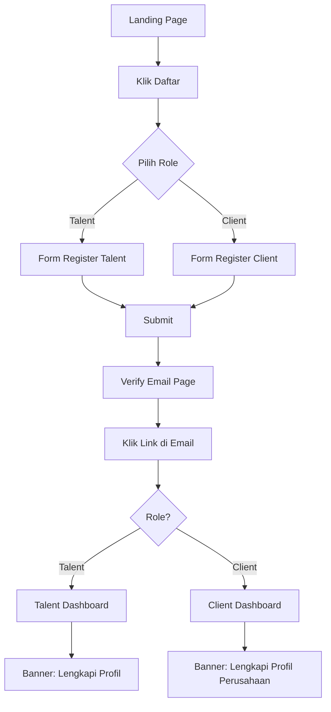
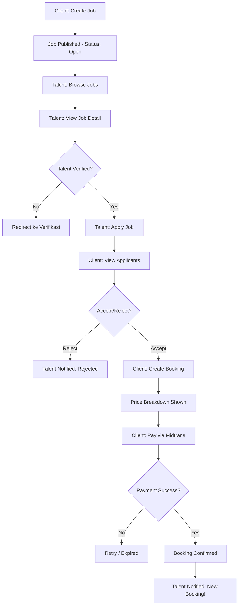
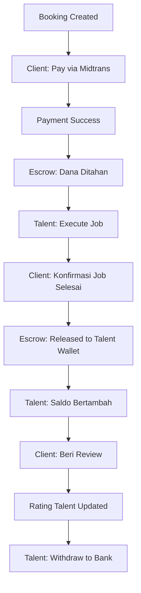
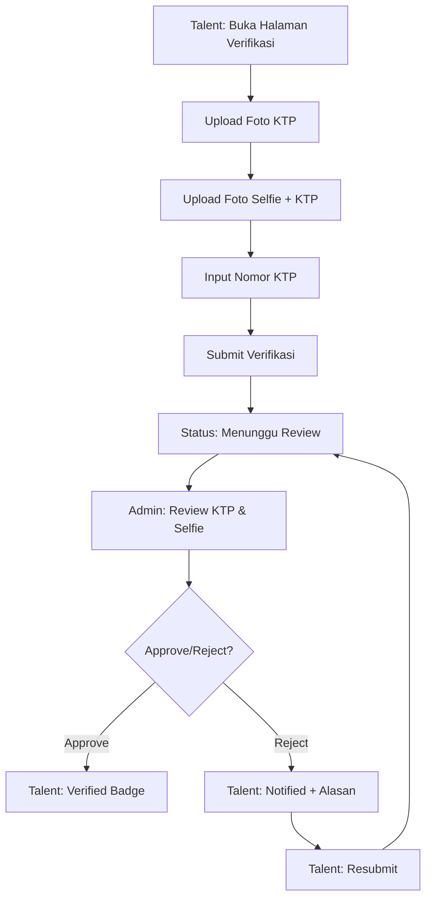
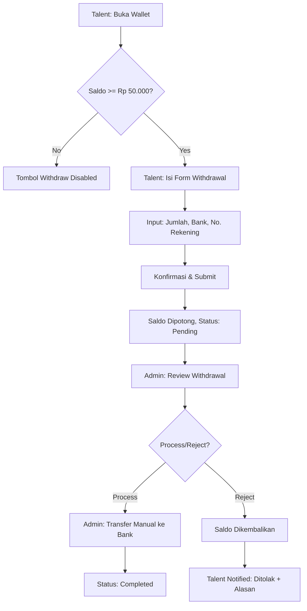

# UI/UX Wireframe & Design Guide

**TALENTARA — Platform Marketplace Talent Digital**
**Versi:** 1.0 | **Tanggal:** Januari 2025

---

## 1. Design System

### 1.1 Brand Identity

| Atribut | Detail |
|---|---|
| Nama | TALENTARA |
| Tagline | Where Talent Meets Opportunity |
| Personality | Professional, Trustworthy, Modern, Approachable |
| Tone | Ramah tapi profesional, menggunakan "Anda" bukan "Kamu" |

### 1.2 Color Palette

**Primary — Blue (Trust, Professional)**
```
primary-50:  #EFF6FF
primary-100: #DBEAFE
primary-200: #BFDBFE
primary-300: #93C5FD
primary-400: #60A5FA
primary-500: #3B82F6  ← Main brand color
primary-600: #2563EB
primary-700: #1D4ED8
primary-800: #1E40AF
primary-900: #1E3A8A
```

**Accent — Purple (Creative, Premium)**
```
accent-50:  #FAF5FF
accent-100: #F3E8FF
accent-500: #A855F7
accent-600: #9333EA
```

**Semantic Colors**
```
success:  #22C55E (green-500)  — Verified, Completed, Paid
warning:  #EAB308 (yellow-500) — Pending, In Progress
error:    #EF4444 (red-500)    — Rejected, Failed, Cancelled
info:     #3B82F6 (blue-500)   — Informational
```

**Neutral**
```
gray-50:  #F9FAFB  ← Page background
gray-100: #F3F4F6  ← Card background hover
gray-200: #E5E7EB  ← Border
gray-300: #D1D5DB  ← Disabled
gray-400: #9CA3AF  ← Placeholder text
gray-500: #6B7280  ← Secondary text
gray-600: #4B5563  ← Body text
gray-700: #374151  ← Heading text
gray-800: #1F2937  ← Dark heading
gray-900: #111827  ← Darkest text
white:    #FFFFFF  ← Card background, input background
```

### 1.3 Typography

**Font Family:** Inter (Google Fonts)

| Element | Size | Weight | Line Height | Tailwind Class |
|---|---|---|---|---|
| H1 | 30px / 1.875rem | Bold (700) | 1.2 | `text-3xl font-bold` |
| H2 | 24px / 1.5rem | Semibold (600) | 1.3 | `text-2xl font-semibold` |
| H3 | 20px / 1.25rem | Semibold (600) | 1.4 | `text-xl font-semibold` |
| H4 | 18px / 1.125rem | Medium (500) | 1.4 | `text-lg font-medium` |
| Body Large | 16px / 1rem | Regular (400) | 1.5 | `text-base` |
| Body | 14px / 0.875rem | Regular (400) | 1.5 | `text-sm` |
| Caption | 12px / 0.75rem | Regular (400) | 1.4 | `text-xs` |
| Label | 14px / 0.875rem | Medium (500) | 1.4 | `text-sm font-medium` |
| Button | 14px / 0.875rem | Medium (500) | 1 | `text-sm font-medium` |

### 1.4 Spacing System

Base unit: 4px (Tailwind default)

| Token | Value | Usage |
|---|---|---|
| `p-1` | 4px | Icon padding |
| `p-2` | 8px | Badge padding, tight spacing |
| `p-3` | 12px | Small card padding |
| `p-4` | 16px | Standard card padding, input padding |
| `p-5` | 20px | Section padding (mobile) |
| `p-6` | 24px | Section padding (desktop) |
| `gap-2` | 8px | Between small elements |
| `gap-3` | 12px | Between form fields |
| `gap-4` | 16px | Between cards |
| `gap-6` | 24px | Between sections |
| `gap-8` | 32px | Between major sections |

**Page Container:**
- Mobile: `px-4` (16px sides)
- Tablet: `px-6` (24px sides)
- Desktop: `max-w-7xl mx-auto px-8` (32px sides, max 1280px)

### 1.5 Component Library (shadcn/ui)

#### Buttons

| Variant | Tailwind Style | Usage |
|---|---|---|
| Primary | `bg-primary-500 text-white hover:bg-primary-600` | CTA utama: "Daftar", "Booking", "Bayar" |
| Secondary | `bg-gray-100 text-gray-700 hover:bg-gray-200` | Aksi sekunder: "Batal", "Kembali" |
| Outline | `border border-gray-300 hover:bg-gray-50` | Aksi alternatif: "Filter", "Edit" |
| Ghost | `hover:bg-gray-100` | Aksi subtle: icon buttons, navigation |
| Destructive | `bg-red-500 text-white hover:bg-red-600` | Aksi berbahaya: "Hapus", "Tolak" |

**Sizes:** `sm` (h-8 px-3), `default` (h-10 px-4), `lg` (h-12 px-6)

#### Cards

```
┌─────────────────────────────────┐
│  Card                           │
│  bg-white rounded-lg border     │
│  border-gray-200 shadow-sm      │
│  p-4 (mobile) / p-6 (desktop)  │
│                                 │
│  Hover: shadow-md               │
│  Active: ring-2 ring-primary    │
└─────────────────────────────────┘
```

#### Status Badges

| Status | Color | Tailwind |
|---|---|---|
| Verified / Completed | Green | `bg-green-100 text-green-700` |
| Pending / In Progress | Yellow | `bg-yellow-100 text-yellow-700` |
| Open / Active | Blue | `bg-blue-100 text-blue-700` |
| Rejected / Cancelled / Failed | Red | `bg-red-100 text-red-700` |
| Draft | Gray | `bg-gray-100 text-gray-600` |

#### Input Fields

```
┌──────────────────────────────┐
│ Label                        │
│ ┌──────────────────────────┐ │
│ │ Placeholder text...      │ │
│ └──────────────────────────┘ │
│ Helper text atau error msg   │
└──────────────────────────────┘

Normal:  border-gray-300 focus:ring-primary-500
Error:   border-red-500 focus:ring-red-500
Disabled: bg-gray-100 cursor-not-allowed
```

### 1.6 Border Radius

| Element | Radius | Tailwind |
|---|---|---|
| Button | 6px | `rounded-md` |
| Input | 6px | `rounded-md` |
| Card | 8px | `rounded-lg` |
| Badge | 9999px | `rounded-full` |
| Avatar | 9999px | `rounded-full` |
| Modal | 12px | `rounded-xl` |

### 1.7 Shadow

| Level | Usage | Tailwind |
|---|---|---|
| None | Flat elements | `shadow-none` |
| SM | Cards default | `shadow-sm` |
| MD | Cards hover, dropdown | `shadow-md` |
| LG | Modals, popovers | `shadow-lg` |

---

## 2. Sitemap

```
TALENTARA
├── / (Landing Page)
├── /login
├── /register
│   ├── /register/talent
│   └── /register/client
├── /verify-email
├── /forgot-password
│
├── [TALENT AREA]
│   ├── /dashboard
│   ├── /profile
│   │   └── /profile/portfolio
│   ├── /jobs
│   │   ├── /jobs/:id (detail)
│   │   └── /jobs/applied
│   ├── /bookings
│   │   └── /bookings/:id
│   ├── /wallet
│   │   └── /wallet/withdraw
│   ├── /reviews
│   └── /verification
│
├── [CLIENT AREA]
│   ├── /dashboard
│   ├── /company
│   ├── /talents
│   │   └── /talents/:id
│   ├── /jobs
│   │   ├── /jobs/create
│   │   ├── /jobs/:id
│   │   ├── /jobs/:id/edit
│   │   └── /jobs/:id/applicants
│   ├── /bookings
│   │   └── /bookings/:id
│   ├── /payments
│   └── /reviews
│
├── [SHARED]
│   ├── /chat
│   │   └── /chat/:roomId
│   ├── /notifications
│   └── /settings
│
└── [ADMIN]
    ├── /admin/dashboard
    ├── /admin/verifications
    ├── /admin/disputes
    └── /admin/withdrawals
```

---

## 3. User Flow Diagrams

### 3.1 Registration Flow



### 3.2 Job → Apply → Booking Flow



### 3.3 Booking → Payment → Escrow → Review Flow



### 3.4 Talent Verification Flow



### 3.5 Withdrawal Flow



---

## 4. Screen Specifications

### 4.1 Landing Page

```
Mobile Layout (375px):
┌─────────────────────────┐
│ [Logo]      [Login][CTA]│  ← Header (sticky)
├─────────────────────────┤
│                         │
│   "Where Talent Meets   │
│      Opportunity"       │
│                         │
│   Marketplace talent    │
│   digital terpercaya    │
│                         │
│   [ Daftar Sekarang ]   │  ← Primary CTA
│   [ Pelajari Lebih ]    │  ← Secondary
│                         │
├─────────────────────────┤
│ ✓ Transparan            │
│ ✓ Aman & Terpercaya     │  ← 3 Value Props
│ ✓ Cepat & Mudah         │
├─────────────────────────┤
│ HOW IT WORKS            │
│ 1. Daftar & Buat Profil │
│ 2. Cari & Booking       │  ← Steps (vertical)
│ 3. Kerja & Dibayar      │
├─────────────────────────┤
│ UNTUK TALENT            │
│ [Card benefits...]      │
├─────────────────────────┤
│ UNTUK PERUSAHAAN        │
│ [Card benefits...]      │
├─────────────────────────┤
│ Footer: links, contact  │
└─────────────────────────┘

Desktop Layout (1280px):
┌──────────────────────────────────────────┐
│ [Logo] [Tentang] [Fitur]    [Login][CTA] │
├──────────────────────────────────────────┤
│                                          │
│  "Where Talent       ┌────────────────┐  │
│   Meets Opportunity" │  Hero Image /  │  │
│                      │  Illustration  │  │
│  [ Daftar Sekarang ] └────────────────┘  │
│                                          │
├──────────────────────────────────────────┤
│ ┌──────┐ ┌──────┐ ┌──────┐              │
│ │Trans-│ │Aman &│ │Cepat │  ← 3 cols   │
│ │paran │ │Trust │ │Mudah │              │
│ └──────┘ └──────┘ └──────┘              │
├──────────────────────────────────────────┤
│  1 ──── 2 ──── 3   (horizontal steps)   │
└──────────────────────────────────────────┘
```

**Components:** Header, HeroSection, ValueProps, HowItWorks, ForTalent, ForClient, Footer
**States:** Default only (public page)

---

### 4.2 Login Page

```
Mobile (375px):
┌─────────────────────────┐
│        [Logo]           │
│                         │
│    Masuk ke TALENTARA   │
│                         │
│  ┌───────────────────┐  │
│  │ Email             │  │
│  └───────────────────┘  │
│  ┌───────────────────┐  │
│  │ Password       👁  │  │
│  └───────────────────┘  │
│                         │
│     Lupa Password?      │
│                         │
│  [ Masuk            ]   │  ← Primary button full-width
│                         │
│  ─── atau ───           │
│                         │
│  [ G  Login Google  ]   │  ← Outline button (P2)
│                         │
│  Belum punya akun?      │
│  Daftar Sekarang        │
└─────────────────────────┘
```

**Components:** Logo, Input (email), Input (password + toggle visibility), Button, Link, Divider
**States:** Default, Loading (button spinner), Error (field highlight + message)

---

### 4.3 Register: Choose Role

```
Mobile (375px):
┌─────────────────────────┐
│    ← Kembali            │
│                         │
│  Daftar sebagai apa?    │
│                         │
│  ┌───────────────────┐  │
│  │  👤               │  │
│  │  Talent           │  │
│  │  SPG, Usher, dll. │  │
│  │  Cari pekerjaan & │  │
│  │  tunjukkan skill  │  │
│  └───────────────────┘  │
│                         │
│  ┌───────────────────┐  │
│  │  🏢               │  │
│  │  Perusahaan       │  │
│  │  Cari talent      │  │
│  │  profesional      │  │
│  └───────────────────┘  │
│                         │
│  Sudah punya akun?      │
│  Login                  │
└─────────────────────────┘
```

**Components:** BackButton, Card (selectable, hover effect), Link

---

### 4.4 Talent Dashboard

```
Mobile (375px):
┌─────────────────────────┐
│ [Av] Hi, Dina!    🔔(3) │  ← Header + notification badge
├─────────────────────────┤
│ ⚠ Lengkapi verifikasi   │  ← Banner (if not verified)
│   KTP untuk mulai kerja │
│   [Verifikasi Sekarang] │
├─────────────────────────┤
│ ┌─────┐ ┌─────┐        │
│ │  12 │ │ ⭐  │        │
│ │ Jobs│ │ 4.8 │        │  ← Stat cards (2x2 grid)
│ └─────┘ └─────┘        │
│ ┌─────┐ ┌─────┐        │
│ │ Rp  │ │  ✓  │        │
│ │1.4M │ │Vrfd │        │
│ └─────┘ └─────┘        │
├─────────────────────────┤
│ Booking Terbaru    >Semua│
│ ┌───────────────────┐   │
│ │ SPG Brand Act.    │   │
│ │ PT ABC - 15 Jan   │   │
│ │ [Confirmed]       │   │
│ └───────────────────┘   │
│ ┌───────────────────┐   │
│ │ Usher Event       │   │
│ │ PT XYZ - 20 Jan   │   │
│ │ [Paid]            │   │
│ └───────────────────┘   │
├─────────────────────────┤
│ Job Untuk Anda    >Semua│
│ ┌───────────────────┐   │
│ │ SPG Product Launch│   │
│ │ Semarang          │   │
│ │ Rp 450.000/hari   │   │
│ └───────────────────┘   │
├─────────────────────────┤
│ [🏠][💼][💬][🔔][👤]   │  ← Bottom nav
└─────────────────────────┘

Desktop (1280px):
┌──────────┬──────────────────────────────┐
│          │ Hi, Dina!              🔔(3) │
│ TALENTARA│                              │
│          │ ┌────┐┌────┐┌────┐┌────┐     │
│ Dashboard│ │Jobs││Rate││Wallet│Vrfd│    │
│ Profile  │ └────┘└────┘└────┘└────┘     │
│ Jobs     │                              │
│ Bookings │ Booking Terbaru              │
│ Wallet   │ ┌──────┐┌──────┐┌──────┐    │
│ Reviews  │ │Card 1││Card 2││Card 3│    │
│ Verify   │ └──────┘└──────┘└──────┘    │
│          │                              │
│ Settings │ Job Untuk Anda               │
│ Logout   │ ┌──────┐┌──────┐┌──────┐    │
│          │ │Job 1 ││Job 2 ││Job 3 │    │
│          │ └──────┘└──────┘└──────┘    │
└──────────┴──────────────────────────────┘
```

---

### 4.5 Talent Search (Client View)

```
Mobile (375px):
┌─────────────────────────┐
│ ← Cari Talent           │
├─────────────────────────┤
│ ┌───────────────────┐   │
│ │ 🔍 Cari nama...   │   │  ← Search bar
│ └───────────────────┘   │
│ [SPG] [Usher] [Semarang]│  ← Filter chips (horizontal scroll)
│ [⚙ Filter Lainnya]      │
├─────────────────────────┤
│ 234 talent ditemukan     │
│ Sort: [Rating ▼]        │
├─────────────────────────┤
│ ┌───────────────────┐   │
│ │ [Foto]            │   │
│ │ Dina Permata  ✓   │   │
│ │ SPG • Semarang    │   │
│ │ ⭐ 4.8 (23)       │   │
│ │ Rp 400.000/hari   │   │
│ └───────────────────┘   │
│ ┌───────────────────┐   │
│ │ [Foto]            │   │
│ │ Sari Wulandari ✓  │   │
│ │ Usher • Semarang  │   │
│ │ ⭐ 4.6 (18)       │   │
│ │ Rp 350.000/hari   │   │
│ └───────────────────┘   │
│         ...             │
├─────────────────────────┤
│ [🏠][💼][💬][🔔][👤]   │
└─────────────────────────┘

Desktop: 3-column grid cards
```

**Filter Dialog (Mobile: Bottom Sheet):**
```
┌─────────────────────────┐
│ ── Filter ──        [X] │
│                         │
│ Kategori                │
│ (•) Semua ○ SPG ○ Usher │
│                         │
│ Kota                    │
│ [Semarang        ▼]    │
│                         │
│ Rating Minimum          │
│ ⭐⭐⭐⭐☆ (4+)           │
│                         │
│ Gender                  │
│ ○ Semua ○ Wanita ○ Pria│
│                         │
│ Tinggi Minimum          │
│ [160] cm                │
│                         │
│ [Terapkan Filter]       │
│ [Reset]                 │
└─────────────────────────┘
```

---

### 4.6 Talent Detail (Client View)

```
Mobile (375px):
┌─────────────────────────┐
│ ←                 [♡]   │  ← Back + Favorite
├─────────────────────────┤
│ ┌───────────────────┐   │
│ │                   │   │
│ │   [Foto Besar]    │   │  ← Avatar 200x200
│ │                   │   │
│ └───────────────────┘   │
│ Dina Permata        ✓   │
│ SPG • Semarang          │
│ ⭐ 4.8 (23 review)      │
│ Rp 400.000/hari         │
├─────────────────────────┤
│ [Booking] [Chat]        │  ← 2 buttons
├─────────────────────────┤
│ Tentang                 │
│ "Berpengalaman 3 tahun  │
│  sebagai SPG untuk..."  │
├─────────────────────────┤
│ Detail                  │
│ Gender:  Wanita         │
│ Usia:    22 tahun       │
│ Tinggi:  165 cm         │
│ Berat:   52 kg          │
├─────────────────────────┤
│ Portfolio          (8)  │
│ ┌────┐┌────┐┌────┐      │
│ │img1││img2││img3│ →    │  ← Horizontal scroll
│ └────┘└────┘└────┘      │
├─────────────────────────┤
│ Pengalaman Kerja   (5)  │
│ • SPG - PT Unilever     │
│   Brand Act. Jan 2024   │
│ • Usher - JCC           │
│   Conference Dec 2023   │
├─────────────────────────┤
│ Review             (23) │
│ ⭐⭐⭐⭐⭐ 5/5            │
│ "Sangat profesional..." │
│ - Budi, PT ABC          │
│                         │
│ ⭐⭐⭐⭐☆ 4/5            │
│ "Komunikatif dan tepat" │
│ - Andi, PT XYZ          │
├─────────────────────────┤
│                         │
│ [Booking Talent Ini]    │  ← Sticky bottom CTA
│                         │
└─────────────────────────┘
```

---

### 4.7 Booking & Price Breakdown

```
Mobile (375px):
┌─────────────────────────┐
│ ← Booking Talent        │
├─────────────────────────┤
│ ┌───────────────────┐   │
│ │ [Foto] Dina P. ✓  │   │  ← Talent info card
│ │ SPG • ⭐ 4.8      │   │
│ │ Rp 400.000/hari   │   │
│ └───────────────────┘   │
├─────────────────────────┤
│ Pilih Job               │
│ [SPG Product Launch ▼]  │
│                         │
│ Tanggal                 │
│ Mulai: [15 Jan 2025]    │
│ Selesai: [16 Jan 2025]  │
│                         │
│ Catatan (opsional)      │
│ ┌───────────────────┐   │
│ │                   │   │
│ └───────────────────┘   │
├─────────────────────────┤
│ Rincian Biaya           │
│ ┌───────────────────┐   │
│ │ Fee (2 hari)      │   │
│ │ 400.000 x 2       │   │
│ │         Rp 800.000│   │
│ │                   │   │
│ │ Platform Fee (5%) │   │
│ │          Rp 40.000│   │
│ │ ─────────────────  │   │
│ │ TOTAL BAYAR       │   │
│ │        Rp 840.000 │   │  ← Bold, larger
│ │                   │   │
│ │ Talent menerima:  │   │
│ │        Rp 720.000 │   │  ← Green, smaller
│ └───────────────────┘   │
├─────────────────────────┤
│                         │
│  [Booking & Bayar]      │  ← Primary CTA
│                         │
└─────────────────────────┘
```

---

### 4.8 Chat Conversation

```
Mobile (375px):
┌─────────────────────────┐
│ ← [Av] Budi Santoso  •  │  ← Header: online indicator
├─────────────────────────┤
│                         │
│  ┌──────────────┐       │
│  │ Hi, saya     │       │  ← Other user (left, gray)
│  │ tertarik     │       │
│  │ booking Anda │       │
│  └──────────────┘ 10:30 │
│                         │
│       ┌──────────────┐  │
│       │ Terima kasih!│  │  ← Me (right, blue)
│       │ Kapan        │  │
│       │ eventnya?    │  │
│       └──────────────┘  │
│                   10:31 │
│                         │
│  ┌──────────────┐       │
│  │ Tanggal 15   │       │
│  │ Januari di   │       │
│  │ Hotel ABC    │       │
│  └──────────────┘ 10:32 │
│                         │
├─────────────────────────┤
│ ┌──────────────────┐ [→]│  ← Input + send button
│ │ Ketik pesan...   │    │
│ └──────────────────┘    │
└─────────────────────────┘
```

---

### 4.9 Admin Dashboard

```
Desktop (1280px):
┌──────────┬───────────────────────────────┐
│          │ Admin Dashboard         [Av]  │
│ TALENTARA│                               │
│          │ ┌─────┐┌─────┐┌─────┐┌─────┐  │
│ Admin    │ │1.200│ │ 85 │ │ 432│ │Rp52M│ │
│ Dashboard│ │Talnt│ │Clnt│ │Book│ │ Rev │ │
│ Verify   │ └─────┘└─────┘└─────┘└─────┘  │
│ Disputes │                               │
│ Withdraw │ ⚠ Pending Actions             │
│          │ ┌──────────────────────────┐   │
│ Settings │ │ 12 KTP menunggu review   │   │
│ Logout   │ │ 3 perusahaan menunggu    │   │
│          │ │ 5 withdrawal pending     │   │
│          │ │ 2 disputes open          │   │
│          │ └──────────────────────────┘   │
│          │                               │
│          │ Booking Bulanan (Chart)        │
│          │ ┌──────────────────────────┐   │
│          │ │ [Bar/Line Chart]         │   │
│          │ └──────────────────────────┘   │
└──────────┴───────────────────────────────┘
```

---

## 5. Responsive Breakpoints

| Breakpoint | Device | Columns | Navigation | Sidebar |
|---|---|---|---|---|
| < 640px (sm) | iPhone SE/14 | 1 | Bottom tab | Hidden |
| 640-767px | Large phone | 1-2 | Bottom tab | Hidden |
| 768-1023px (md) | iPad | 2 | Top header | Collapsible |
| 1024-1279px (lg) | Laptop | 2-3 | Top header | Visible (narrow) |
| >= 1280px (xl) | Desktop | 3-4 | Top header | Visible (full) |

**Layout Changes:**

| Element | Mobile | Desktop |
|---|---|---|
| Navigation | Bottom tab bar (5 items) | Left sidebar |
| Cards grid | 1 column | 2-3 columns |
| Filter | Bottom sheet modal | Sidebar or inline |
| Dialog/Modal | Full screen bottom sheet | Center overlay (max-w-md) |
| Tables | Card list view | Table view |
| Search bar | Full width | Max 400px |
| Dashboard stats | 2x2 grid | 4 inline |

---

## 6. Navigation Patterns

### Mobile Bottom Tab Bar

```
┌─────────────────────────────────┐
│  🏠      💼      💬     🔔    👤 │
│ Home    Jobs    Chat  Notif  Me │
└─────────────────────────────────┘
```

**Talent tabs:** Home, Jobs, Chat, Notifications, Profile
**Client tabs:** Home, Talents, Chat, Notifications, Company

### Desktop Sidebar

```
┌──────────────┐
│ [TALENTARA]  │
│              │
│ 📊 Dashboard │
│ 👤 Profile   │
│ 💼 Jobs      │
│ 📋 Bookings  │
│ 💰 Wallet    │  ← Talent only
│ ⭐ Reviews   │
│ 💬 Chat      │
│ 🔔 Notifikasi│
│              │
│ ──────────── │
│ ⚙ Settings  │
│ 🚪 Logout    │
└──────────────┘
```

### Breadcrumbs (Desktop, deep pages)
```
Dashboard > Jobs > SPG Product Launch > Applicants
```

---

## 7. Interaction & Animation Guidelines

### 7.1 Transitions

| Element | Animation | Duration | Easing |
|---|---|---|---|
| Page transition | Fade in | 200ms | ease-out |
| Modal open | Slide up (mobile), Fade+Scale (desktop) | 300ms | ease-out |
| Modal close | Slide down / Fade out | 200ms | ease-in |
| Toast appear | Slide in from right (desktop) / bottom (mobile) | 300ms | ease-out |
| Toast dismiss | Fade out | 200ms | ease-in |
| Button hover | Background color | 150ms | ease |
| Card hover | Shadow increase | 200ms | ease |
| Skeleton shimmer | Pulse animation | 1.5s | linear loop |

### 7.2 Loading States

- **Full page:** Centered spinner + "Memuat..."
- **Section:** Skeleton cards (shimmer effect)
- **Button:** Spinner icon replaces text, button disabled
- **Inline:** Small spinner next to element

### 7.3 Empty States

Format konsisten:
```
┌───────────────────────┐
│     [Illustration]    │
│                       │
│   Belum ada [item]    │
│                       │
│  Deskripsi singkat    │
│  apa yang bisa user   │
│  lakukan              │
│                       │
│  [Action Button]      │
└───────────────────────┘
```

### 7.4 Error States

- **Form field error:** Red border + red helper text below
- **Toast error:** Red background, icon warning, auto-dismiss 5s
- **Full page error:** Illustration + "Terjadi Kesalahan" + retry button

### 7.5 Success States

- **Toast success:** Green background, checkmark icon, auto-dismiss 3s
- **Action success:** Checkmark animation + redirect setelah 1s

---

> **TALENTARA UI/UX Wireframe Guide v1.0**
> PT. LAMBE TURAH GROUP | 2025
